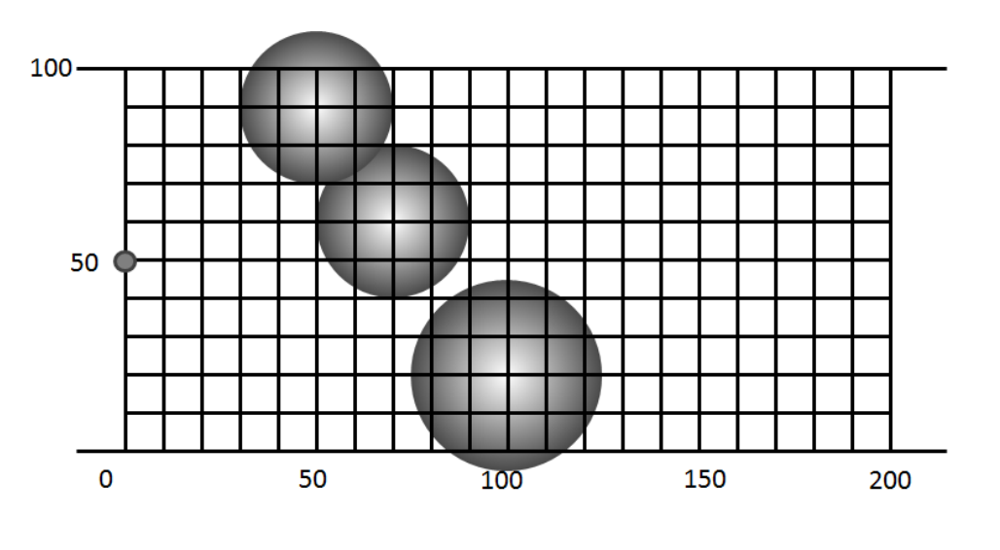

## 문제

Friendship One is a brand new rover commissioned by the Astronautical Center for Machinery to explore Triton, a moon of Neptune. It is being launched into space on March 18th, and the pressure is on to finish the software in time. Your boss has given you a very important task crucial to the completion of the mission.

In order to gather all of the necessary samples the rover must cross a canyon. Friendship One is equipped to travel on all sorts of rocky terrain, but this canyon is littered with circular craters. Your boss is concerned that if Friendship One takes a path that travels through one of these craters, Friendship One will fall over and the mission will end in failure. Some of these craters overlap with each other, which could create large impassable regions inside the canyon. It is up to you to program Friendship One to decide whether a canyon is passable or not. Are you up to the task?

The diagram below indicates the first test case in the sample data. Note that Friendship One is small enough compared to the size of the craters that it can be treated as a point; it has no area.

## 입력

The first line of input is the number of test cases that follow. Each test case starts with a line containing three integers, H, W, and N. H and W (1 ≤ H, W ≤ 10000) indicate the height and width of the canyon, respectively. N (0 ≤ N ≤ 1000) indicates the number of craters that follow. Each crater appears on a line by itself and contains three floating point values, X, Y, and R separated by spaces. X and Y (0 < X − R; X + R < W), (0 ≤ Y ≤ H) represent the center of the crater, while R is the radius of the crater.

Friendship One always starts at X = 0, with the destination being at X = W. Note that no point on the crater will overlap with X = 0 or X = W, so Friendship One can move vertically at these positions without difficulty.

## 출력

For each case output “Case x:” where x is the case number, on a single line, followed by the string “Clear To Go” if the canyon is passable and “Find Another Path” of the craters block the path.
