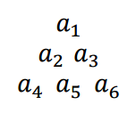
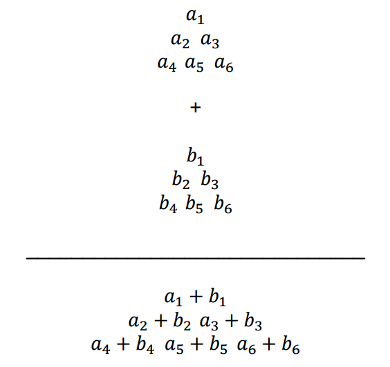
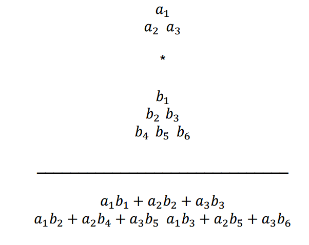

## 문제

Let triangular matrices be defined as equilateral triangles with numbers in the form:

Let triangular matrix addition be defined as:

Let triangular matrix multiplication be defined as:

The multiplication operation is not commutative, and the first matrix, A, must be of size less than or equal to B. The elements in the resultant matrix will be determined by matching A with every triangle of size A within the matrix B. For each of these matchings, multiply the overlapping elements of A and B and then sum them. Each matching will have a corresponding place in the resulting matrix.

In the example above, the A matches to the sub matrices formed by: {b1, b2, b3}, {b2, b4, b5} and {b3, b5, b6}. So taking the element wise multiplication and then sum of each sub matrix with matrix A gives the values c = a1b1 + a2b2 + a3b3, d = a1b2 + a2b4 + a3b5 and e = a1b3 + a2b5 + a3b6. Since c corresponds to the top submatrix from B, it will be in the top position in the resulting matrix. d and e will be in the next row with d to the left of e because that is how the original corresponding submatrices of B were arranged.

The input will be given in postfix notation. For example, if you were given:

A B \* A +

That would correspond to:

(A \* B) + A

To solve this expression, start from the left side. First you get A, then B, then \*. Which means A\*B, we'll call this result C. Replace A B \* with C, since that operation has been done. That leaves C A +, which means A + C, giving you the final result.

## 입력

Input sets will be given by an integer N, the number of matrices involved in the operation. For the next N lines, the matrices will be specified. A matrix will be specified by a string identifier K followed by an integer L, the length of each side of the matrix. The next L lines will contain the values in the matrix, each value separated by a space. The first line will only contain 1 value, the second line will contain 2 values, the third line will contain three values, and so on until the L th line. The first line with one value signifies the top point of the triangle, and the Lth line of L values signifies the bottom of the triangle.

After the matrices are given, there will be an expression, with spaces between the operators and symbols that needs to be evaluated. The expression will contain matrices that are represented by their string identifiers. The end of input will be given by N = 0.

## 출력

The output should be given by the resultant triangular matrix. It should be output in the same way the matrices were input. The top value on the first line, the next lowest values in order on the second line, all the way to the bottom row. If the expression is impossible to evaluate, output: “Invalid expression”.
