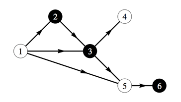

## 문제

To determine their social position, spies like to play games of wit and cunning. One of these games is the dreaded alternating game. It is played by two players, who are called player even and player odd. These strange player names are used to determine the winner of each game: player even wins if the number of moves in the completed game was even, and similarly player odd wins if the number of moves was odd.

Every game is played on a specially prepared game board, consisting of places and one-way connections between certain pairs of places. Every place is controlled by one of the two players. The game starts by putting a token on the starting place of the game board. Every turn, the player who controls the place where the token resides must make a move by moving the token along one of the outgoing connections of that place. This continues until no more move is possible, at which point the winner of the game is known. All game boards are constructed such that infinite games are impossible.

The rules of the game state that both spies playing the game must come to an agreement on which player each one will be. The spies have figured out that picking their player is the most important part of the game. Special agent Walker wants to win every game she plays to improve her social position. She can play the game perfectly if she knows which player to pick at the start of the game. She developed a special set of skills to ensure that she will always get to be the player she wants to be. It is your task to help her pick the best player for a specific game board. Better make sure it is correct; you do not want to disappoint special agent Walker.

A visual representation of the third sample. The dark circles indicate places controlled by the even player. Despite having the first move, the odd player loses. If he moves the token from 1 to 3, the even player wins directly by moving the token to 4. If the odd player moves the token to 2, the even player first moves the token to 3 (as he must) and then to 5, after which the odd player is forced to move the token to 6 and thus loses (four moves were made). Similarly, moving the token to 5 at the first move leads to an automatic win for the even player.

## 입력

On the first line one positive number: the number of test cases, at most 100. After that per test case:

* one line with three space-separated integers n, c and s (1 ≤ n ≤ 10 000, 0 ≤ c ≤ 100 000 and 1 ≤ s ≤ n): the number of places, the number of connections on the game board, and the starting place of the game, respectively.
* n lines with an integer pi: the player controlling place i, using 0 for player even and 1 for player odd.
* c lines with two space-separated integers a and b (1 ≤ a; b ≤ n), indicating a connection from place a to place b.

## 출력

Per test case:

* one line with either 0 or 1, indicating the player that special agent Walker should choose in order to win.
