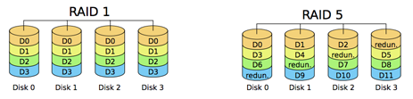

## 문제

NSA는 점점 늘어나는 러시아어와 스페인어 번역 데이터와 전화 도청 파일의 용량 때문에, 데이터 센터의 용량을 최대 1 엑사바이트로 확장하려고 한다.

NSA의 예산은 넉넉한 편이 아니기 때문에, 새 디스크를 구매할 수 없다. 따라서, 불필요한 데이터를 제거해 용량을 확보하려고 한다.

모든 서버는 네 디스크가 RAID-1을 이루고 있다. RAID-5로 방식을 바꿔 용량을 확보해보자.

현재 데이터 센터에는 총 n개의 RAID-1 세트가 있다. 각각의 세트 i는 크기가 Si인 디스크로 이루어져 있다. 이 세트는 데이터 Si GB를 보관할 수 있다. RAID-5 세트로 변환하면 보관할 수 있는 용량이 총 세 배가 된다. (3 · Si GB) 되도록 적은 용량을 RAID-5로 변환해 필요한 용량을 얻는 프로그램을 작성하시오.

디스크의 용량 S = 4이고, 저장 가능 용량은 4 GB (D0 ... D3)과 3 · 4 = 12 GB (D0 ... D11) 이다.

## 입력

첫째 줄에 테스트 케이스의 개수가 주어진다. 테스트 케이스의 수는 100개를 넘지 않는다.

각 테스트 케이스의 첫째 줄에는 RAID-1 세트의 수 n과 확보해야 하는 용량 e 가 주어진다. (1 ≤ n ≤ 100 and 0 ≤ e ≤ 109)

둘째 줄에는 각 세트의 크기 S1 ... Sn (1 ≤ Si ≤ 2 000)가 주어진다.

## 출력

각 테스트 케이스 마다 변환해야 하는 용량(GB)을 출력한다. 용량을 e만큼 더 확보할 수 없는 경우에는 “`FULL`”을 출력한다.

## 힌트

* 첫 번째 예제의 경우에, RAID 세트 하나를 변환하면 된다. 새로운 용량은 1500 + 500 = 2000 GB가 된다.
* 두 번째 예제는 600 GB와 700 GB 디스크를 변환하면 400 + 600 + 700 + 1000 = 2700 GB, 400 + 1800 + 2100 + 1000 = 5300 GB가 된다. 다른 변환은 모두 비효율적이다.
* 세 번째 예제의 경우는 필요한 용량을 확보할 수 없다.
