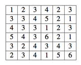
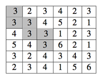
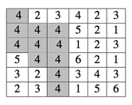

## 문제

Flood-It is a popular one player game on many smart phones. The player is given an n × n board of tiles where each tile is given one of 6 colours (numbered 1–6). Each tile is connected to up to 4 adjacent tiles in the North, South, East, and West directions. A tile is connected to the origin (the tile in the upper left corner) if it has the same colour as the origin and there is a path to the origin consisting only of tiles of this colour.

A player makes a move by choosing one of the 6 colours. After the choice is made, all tiles that are connected to the origin are changed to the chosen colour. The game proceeds until all tiles have the same colour. The goal of the game is to change all the tiles to the same colour, preferably with the fewest number of moves possible.

It has been proven that finding the optimal moves is a very hard problem. For this problem, you will simulate a very simple greedy strategy to see how well it works:

for each move, choose the colour that will result in the largest number of tiles connected to the origin;  
if there is a tie, break ties by choosing the lowest numbered colour.

To illustrate this, we look at the first test case in the sample input, the original board is:

If we choose colour 3 for the first move, the result will be:

where the tiles connected to the origin are shaded. In the next move, we choose colour 4 because we can increase the number of tiles connected to the origin by 5 tiles:

## 입력

The input consists of multiple test cases. The first line of input is a single integer, not more than 20, indicating the number of test cases to follow. Each case starts with a line containing the integer n (1 ≤ n ≤ 20). The next n lines each contains n characters, giving the initial colours of the n × n board of tiles. Each colour is specified by a digit from 1 to 6.

## 출력

For each case, display two lines of output. The first line specifies the number of moves needed to change all the tiles to the same colour. The second line specifies 6 integers separated by a single space. The ith integer gives the number of times colour i is chosen as a move in the game.
