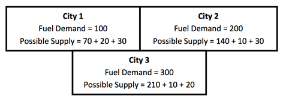
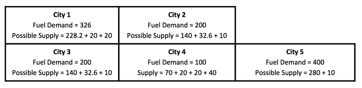

## 문제

In petroleum retail industry, the locations of service stations are very important to the profit of their company. To maximize the profit, the company uses the concept of “Network Planning” to choose where to build new service stations.

You are a consultant of this company. This company gives you the data which consists of the number of cities and how are they connected, number of liters of fuel demand, list of cities that already had a service station, and a total number of new service stations to be constructed in their plan this year.

Of course, the result that they need from you is “which cities should they construct new service stations to maximize their profit”. Sounds simple, isn’t it?

Here is a list of what you might need to know.

* There will be N cities in this country. Each city can own only one service station.
* Assuming each service station is able to supply unlimited fuel demand.
* Each service station will supply 70% of fuel demand (in liters) within its city, plus 10% of each neighboring city’s demand regardless of a fact that whether neighboring cities have their own service station or not.
* For example, if City A, City B, and City C are all connected; City A and City B has their own service stations, then City A will supply 70% fuel demand of itself plus 10% from City B and 10% from City C. So does City B.
* Due to geographical constraints, each city will have no more than three neighboring cities.
* Last, but not least, their total revenue is a direct variation of total fuel demand that they can supply

## 입력

First line of input is a number of test cases T ≤ 10.

Each test case start with the number of cities N (1 ≤ N ≤ 100000).

Following N lines has an Integer Di (0 ≤ Di ≤ 1000) the fuel demand in each city.

Next line contains an integer E number of edges.

Following E lines has 2 integers C1 and C2, describe bi-directionally neighboring cities. There will not be any duplicated edges in the input (i.e. if there is an edge for (C1, C2), there will not be an edge for (C2, C1) in the same input set). Also note that all cities will be numbering from 1 to N.

Next line contains an integer S (0 ≤ S < N) the number of existing service stations

Following S lines has an integer C the city which already owned service station

Last line contains an integer M (1 ≤ M ≤ N–S) an exact number of new service stations they must construct this year.

## 출력

For each test case, display two lines of output.

First line display a positive integer (using general rounding rules) the maximum total fuel demand they can supply including from both existing service stations and new service stations at the optimal cities.

Second line display a list of the optimal cities that they must construct new service stations, given space-separated and in increasing order. The cities with existing service stations are not counted into this list. If there is more than one possible solution, output the one that is first in lexicographical order.

## 힌트

First Example

In this illustration, you will see that if they construct a new service station in City 3 only, it will maximize the total supply to 360 liters.

The second example

In this example, there are two best solutions. Constructing new stations in city 1, city 2 and city 5 will give the same profit as constructing new stations in city 1, city 3 and city 5. We must answer 1 2 5 because it appear first in lexicographical order. The total supply will be 268.2 for the city 1, 182.6 for the city 2 and 290 for the city 5. The city 4 which we already have a service station supplies 150 liters. The total supply is 268.2 + 182.6 + 290 + 150 = 890.8. This is rounded to 891.

