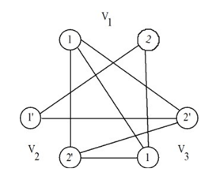

## 문제

A k-partite graph is a graph whose vertices can be partitioned into K disjoint sets so that no two vertices within the same set are adjacent. In this problem we consider a special version of a k-partite graph in which each disjoint set contains exactly two vertices. Let us call this graph magic graph. In what follows we characterize such magic graphs.

Let P be a set of positive labels {1, 2, 3, 4, …} and N be a set of negative labels {1', 2', 3', 4',…}. Also let L = P ∪ N. A magic graph is a k-partite graph G = (V, E), where V is a set of vertices and E is a set of edges. We define V = V1 ∪ V2 ∪ V3 ∪ … ∪Vk , where each Vi ⊂ L and |Vi| = 2. There is an edge {l1, l2} in G if and only if l1 and l2 are in different vertex sets and l1 and l2 are not positive and negative labels of the same number. For instance, the following graph is a magic graph.

This graph is a tripartite magic graph. V1 is {1, 2}. V2 is {1', 2'}. V3 is {1, 2'}. Be noted that multiple nodes may have the same label. For example, the node labeled 1 in V1 is a not the same node as the node labeled 1 in V3. The edges follow the rule above. For example, there are edges {1, 1} and {1, 2'} because the labels are in different vertex sets and they are not positive and negative labels of the same number. Observe that edge {1, 1'} does not exist because the two labels are positive and negative labels of the same number.

Given a k-partite magic graph G, your job is to find whether there exists a k-clique in G.

## 입력

First line of input is a number of test cases T ≤ 10.

The format of each test case is as follow.

* The first line contains the integer K (2 ≤ K ≤ 24 000).
* The following K lines describe set Vi, one per line. For each line, there are two labels separated by a blank space. A positive label is represented by a positive number and a negative label by a minus sign and a positive number.

## 출력

The output file contains only one line of strings of length T in {Y, N}\*. That is, for each test case, if a given magic graph G has a k-clique, print Y, otherwise, print N.
