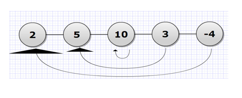
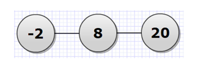

## 문제

상근이와 창영이는 수열 접기 게임을 해보려고 한다. 게임은 아래와 같이 진행된다.

1. 2보다 크거나 같은 정수 하나를 임의로 고른다.
2. 임의의 정수 N개로 이루어진 수열을 만든다.
3. N이 2인 경우에는 단계 6으로 이동한다.
4. 첫 번째 수를 N번째 수와 더하고, 두 번째 수를 N-1번째 수와 더하는 형식으로 수열을 접어 새로운 수열을 하나 만든다. N이 홀수인 경우에는 가운데 수를 자기 자신과 더한다. 아래 그림 1은 접는 과정을 나타낸다.
5. N을 ceil(N/2)로 바꾸고, 단계 3으로 이동한다.
6. 이제 수열에는 숫자 두 개가 포함되어 있다. 첫 번째 수가 두 번째 수보다 큰 경우에는 상근이가 이기고, 나머지 경우는 창영이가 이긴다.

그림 1.a 접기 전

그림 1.b 한 번 접고 난 후

그림 1.c 한 번 더 접고 난 후, 상근이가 이겼다!

정수 N개로 이루어진 수열이 주어졌을 때, 수열 접기 게임의 승자를 구하는 프로그램을 작성하시오.

## 입력

첫째 줄에 테스트 케이스의 개수 T (1 ≤ T ≤ 100)가 주어진다. 각 테스트 케이스의 첫째 줄에는 수열에 포함된 수의 개수 N (2 ≤ N ≤ 100)이 주어진다. 둘째 줄에는 수열이 주어진다. 수열을 이루는 숫자는 32비트 부호있는 정수범위이다.

## 출력

각 테스트 케이스마다 상근이가 이긴 경우에는 Alice, 창영이가 이긴 경우에는 Bob을 테스트 케이스 번호와 함께 출력한다.
