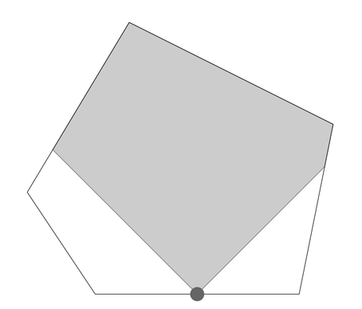

## 문제

상근이는 방에 감시 카메라를 놓으려고 한다.

방은 2차원 평면 위에 있는 볼록 다각형으로 나타낼 수 있다. 카메라는 벽에 놓을 수 있으며, 변의 중간에만 놓을 수 있다.

카메라가 촬영할 수 있는 영역의 영역은 벽과 45도로 교차하는 직선이다. 카메라가 촬영할 수 있는 영역을 구하는 프로그램을 작성하시오.

위의 그림은 문제의 첫 번째 예제를 그림으로 나타낸 것이다. 카메라는 점으로 나타나 있고, 촬영할 수 있는 영역은 회색으로 칠해져 있다. 카메라가 촬영할 수 있는 영역은 방 전체 면적의 71.25% 이다.

## 입력

첫째 줄에 테스트 케이스의 수가 주어진다. 테스트 케이스의 개수는 100개를 넘지 않는다. 각 테스트 케이스의 첫째 줄에는 방의 꼭짓점의 개수 n (3 ≤ n ≤ 1000)이 주어진다. 다음 n개 줄에는 꼭짓점 좌표 x와 y가 주어진다. (-10,000 ≤ x, y ≤ 10,000)

꼭짓점은 반시계 방향 순서로 주어지며, 모든 각도는 0보다 크고, 180도보다 작다. 카메라는 처음 두 꼭짓점의 중간에 놓여져 있다.

## 출력

각 테스트 케이스마다 카메라가 촬영할 수 있는 영역의 크기를 출력한다. 방 전체의 크기를 1이라고 했을 때, 상대적인 크기를 출력하면 된다. 절대/상대 오차는 10-6까지 허용된다.
