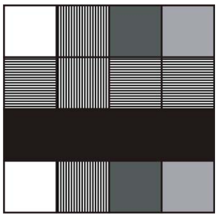

## 문제

Ethan wants to draw a painting on an m×n board. He can draw some strips on the board using a paintbrush of width one. In each step, he must choose a new color and paint a full column or a full row. He has a great image to be drawn on the board, but he doesn’t know which color to use first. You must help him in finding out the order of colors.

## 입력

There are multiple test cases in the input. The first line of each test case contains two integers m and n, the size of the board (0< m, n <100). Following the first line, there are m lines with n integers denoting the color in each cell. All the colors are positive integer numbers less than 10000. The input is terminated with a single line containing two consecutive zeros.

## 출력

For each test case, write a single line containing the order of colors used to paint the board. If there are several answers, output the one which is lexicographically smallest (considering each number as a symbol).
