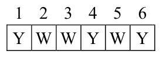

## 문제

The floor of Gholam’s bedroom is tiled with white and yellow tiles. Sometimes when he is bored, he stands on one of the tiles and starts to walk along the row he is standing on. He first decides on a number n and starts to walk n steps. If he reaches the wall, he turns back and continues to walk in the opposite direction. He continues until he takes n steps. Note that turning back besides a wall does not count as a step. He counts how many yellow tiles he steps on.

For example, the figure on the right shows a row in the floor. The colors of the tiles are shown with the characters ‘Y’ and ‘W’ for yellow and white tiles respectively. If he starts at tile 3 facing to the right, and decides to take 7 steps, he finally stops at tile 2. During this walk, he steps 3 times on yellow tiles.

## 입력

The input contains T test cases. The first line of input has only the integer T. Each test case contains two lines. The first line contains two integers m (3 ≤ m ≤ 100) and n (1 ≤ n ≤ 1000), which is the number of steps Gholam takes. The second line contains m integers describing the tiles in the row and is in the following format:

```

a1 a2 ... am
```

Each ai is either 0, 1, 2, or 3. If ai = 0, then ai has a yellow tile, and ai > 0 indicates that ai has a white tile. If ai = 2, then Gholam is starting from the tile ai, facing to the right, and if ai = 3, then he is starting from the tile ai, facing to the left. The numbers are separated by space characters. You may assume that exactly one of the numbers is 2 or 3. Note that it is implied that Gholam always starts from a white tile.

## 출력

For each test case, write a single line in the output having a single number which is the number of times Gholam steps on a yellow tile.
