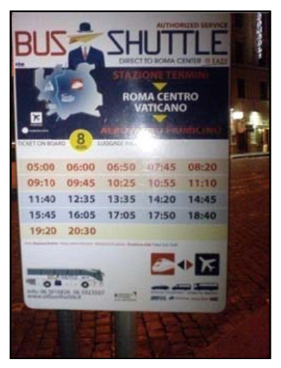

## 문제

Pasha is a passenger in Rome, Italy. He is in the train station terminal right now (named Stazione Termini in Italian) and wants to go to the airport of Rome (named Aeroporto Fiumicino) as soon as possible.

Just in front of the exit door of Termini, he found a bus station for Bus Shuttle service which takes the passengers right to airport for only 8 Euros per passenger, luggage included! “Sounds economic and fast!”, said Pasha with himself and decided to wait for the bus.

Under the sign for Bus Shuttle, there was a time table in which only leaving time of buses was written. As it is around 7:00 AM in Rome now, he has to wait until 7:45 AM for the first bus to come.

Pasha is curious to know the travel time between Stazione Termini and Aeroporto Fiumicino. He asks a passenger in the bus station but they do not know it or their English are too weak to talk to Pasha! However, a passenger tells Pasha:

“I remember, it was yesterday at 13:15, that I was in a bus shuttle to Termini and saw another bus shuttle (going to Aeroporto) just passed us, in the opposite direction. But, I can’t remember when I got sit in the bus and when we arrived to Aeroporto. All I remember is a cross with another shuttle at 13:15”.

Not enough information, but still useful. A few minutes later, some other passengers gave the same type of information to Pasha – exactly a meet at a certain time with a shuttle bus coming in opposite direction while they were in a bus.

And finally Pasha found a brochure of the shuttle service, in which not only the time table of “Termini to Aeroporto” was written, but also the time table of “Aeroporto to Termini” could be found (i.e. the same table in the figure, but in the Aeroporto station and for buses that are leaving Aeroporto to Termini).

Having these two time tables and some meeting-times (like 13:15 in above example), Pasha asks for your assistance to discover the travel time between Termini and Aeroporto, in minutes.

You may assume that all buses are moving with constant speed and without stop in the middle of the way. We know that the travel time is less than 24 hours. You can also assume each bus goes to parking after arriving to its destination and all the buses are leaving in a single day i.e. if there are n leaving times written on Termini station and m leaving times are on Aeroporto station, then assume only n+m buses exist in Rome, which have n×m possible meeting times.

## 입력

The input consists of several test cases. Each test case begins with a line containing two numbers n (the number of buses going from Termini to Aeroporto) and m (the number of buses going from Aeroporto to Termini) in the day of our story. It is guaranteed that 0 < n,m ≤ 100.

In the second line of each test case, n distinct and space-separated times are given between 00:00 and 23:59 (inclusive) with leading zero when minutes or hours are single digit. They are the times a buses leaves Termini to Aeroporto. The third line contains m distinct times, in the same format, for the buses leaving Aeroporto to Termini. You can assume either all of these m + n times are even, or all of them are odd (in minutes).

The fourth line contains an integer 1 ≤ k ≤ 100, the number of passengers who have given “meeting time while was in bus” to Pasha. These k times are written in the fifth line in the same format for time as above and separated by space. Hint: Although all buses are leaving in the same day but they may meet the day after! For example, if the travel time is 8 hours, then a bus leaving at 22:00 from A to T will meet the bus leaving at 23:00 from T to A at 06:30 next day. This way, a report of 06:30 may belong the morning of the same day (e.g. a bus left at 05:00 met the bus left at 06:00 of opposite direction and the travel time is 2 hours, or the prior case). Remember that a meet can occur even in stations!

For example, a bus may leave at 21:05 and another bus from the opposite direction arrives exactly at the same time. The last line of the input contains to zero numbers.

## 출력

For each test case, if the travel time can be found and is unique, write it in a single line. If no travel time can satisfy the claims of the passengers write “il bugiardo passeggeri!” (without quotes) for this case and proceed to the the next line. Otherwise, if there are c > 1 possible travel times (in range 00:01 to 23:59, of course) write “c scelte” where c is substituted with its value. Note that the travel times cannot have fractions of minutes.
