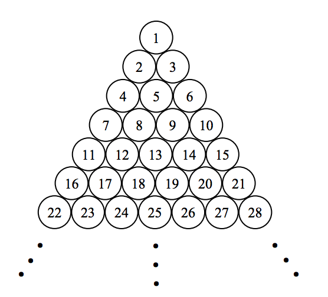

## 문제

Two friends, Petey and Patty are locked up in a maze. The maze has an infinite number of circles of the same size, arranged like the figure on the right. Petey and Patty are initially standing on two (not necessarily distinct) circles.

Petey wants to reach her friend Patty. In each step, she can go from the circle she is standing on, to one of the adjacent circles. Two circles are adjacent to each other, if they share a point.

Given the numbers (as shown in the figure) of the two circles Petey and Patty are standing on initially, you’re to find the minimum number of steps Petey needs to reach her friend.

## 입력

The input contains several test cases. Each test case is a line containing two space-separated integers specifying the initial circles Petey and Patty are standing on. None of these numbers is more than 10000. The last line contains “0 0” which shows the end of the input, and should not be processed.

## 출력

Write the result of the ith test case, on the ith line of output. You should just write one integer indicating the minimum number of steps Petey needs to reach her friend.
