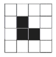

## 문제

The Great Farmer has decided to build a fence around his farm. His farm is made up of some connected unit squares on a grid; the farm does not have any holes. The farmer needs to know the length of the fence required to surround his farm, and has asked for your help. Given the places of all the unit squares, your task is to calculate the perimeter of the farm. For example, in the figure on the right, the farm is made up of 3 (dark) unit squares, and its perimeter is 8.

## 입력

There are multiple test cases in the input. Each test case starts with a line containing a single integer number N (1 ≤ N ≤ 1000), the area of the farm. Each of the next N lines has two space-separated integers x and y (0 ≤ x, y ≤ 100), where (x, y) shows the coordinates of the lower left corner of a unit square in the farm. The input terminates with a line containing “0” which should not be processed.

## 출력

Write the result of the ith test case, on the ith line of output. You must write a single integer indicating the perimeter of the farm.
