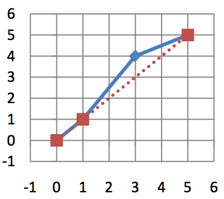

## 문제

Irvanistan and Jikjikestan are two neighboring countries that have fought several wars with many casualties over their border dispute. Despite the loss of lives in the scale of tens of thousands, none of their border claims have been accepted by the other party.

Recently, the logical leaders who have gained control of both countries have accepted the United Nations proposal to resolve their border dispute. The proposal is to come up with a shorter and simplified version of the border that is calculated by a fair computer program.

To describe the problem accurately, let the current border P be a set of non-crossing line segments each connecting two border points. Let p0, p1, … , pN be these border points; i.e., P is exactly composed of the line segments connecting pi and pi+1, for 0 ≤ i < N.

The UN suggests to create a new border C with points c0, c1, … , cK, in such a way that c0 = p0 and cK = pN and the following constraints are satisfied.

1. Each point ci should be one of the points p0, … , pN. Obviously, if ci = pr and ci+1 = ps, then s > r.
2. Each point pi should have a distance of at most some given number D from C. The distance of pi from C is defined as the distance from pi to the closest point on C. Note that, the line segment drawn from pi to the closest point on C, is always perpendicular to C.

Your task is to find a new border C with the shortest possible length, while adhering to the above constraints.

## 입력

There are multiple test cases in the input. The first line of each test case contains N (2 ≤ N ≤ 100), the number of points followed by D (0 ≤ D ≤ 500). Each of the next N lines contains two integers xi, yi (−10000 ≤ xi,yi ≤ 10000) which are the coordinates of the point pi. Note that the point coordinates are increasing; i.e. xi < xi+1 and yi < yi+1. The input terminates with a line containing “0”.

## 출력

For each test case write a single line containing the shortest possible length of the new border with exactly two digits after the decimal point.
