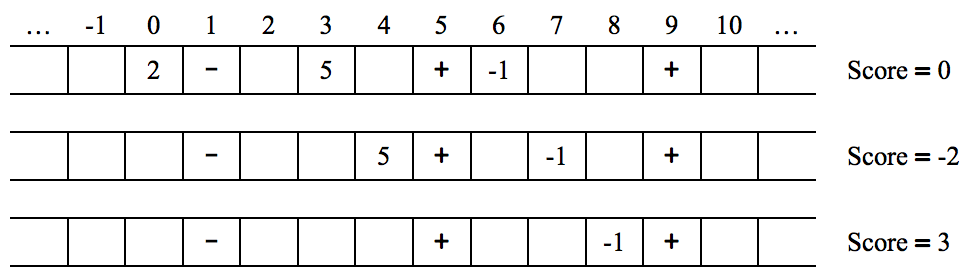

## 문제

There is a single-player game played on a one-dimensional infinite-from-both-ends array containing integers, + signs and - signs. In each turn, the player can move all integers one cell to the left or one cell to the right (signs remain fixed).

The player’s initial score is 0; when an integer I moves into a cell containing the sign S (+ or -), the integer is removed from the array and the score is increased by S × I.

The player can stop the game anytime he/she wants.

Below you can see the initial and the following states of the array, after two right moves are made.

Your task is to find the maximum possible score one can get from a given initial array.

## 입력

There are multiple test cases in the input. The first line of each test case starts with N (1 ≤ N ≤ 100), the number of integers, followed by Np (1 ≤ Np ≤ 100), the number of + signs and Nm (1 ≤ Nm ≤ 100), the number of - signs. Each of the next N lines contains two integers pi (−300 ≤ pi ≤ 300), the position and vi (−9 ≤ vi ≤ 9), the value of the ith integer. The following line contains Np integers indicating the positions of the + signs. The following line contains Nm integers indicating the positions of the - signs. The positions are all between −300 and 300, and no two elements (integers and signs) are initially placed at the same position. The input terminates with a line containing “0 0 0”.

## 출력

For each test case write a single line containing the maximum possible score.
