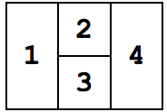

## 문제

Several robots are moving around in an area, sending their locations to a server. Receiving a stream of locations sent by the robots, the server needs to find out the number of robots present in the area.

Assume that the area is a closed polygon, partitioned into some non-overlapping regions labeled 1, … , N. All robots are initially located in region 1. They all start moving around in the scene. When a robot enters a new region, it sends the region’s label to the server. Note that each robot can enter and leave any region multiple times.

The server receives one long stream of region labels, without knowing the identity of the sender robots. Knowing the stream and the area’s map, it needs your help to figure out the number of robots present in the area.

Your task is to find out the minimum and the maximum number of robots that may have created such a stream, assuming that each robot has at least once sent a region label to the server.

## 입력

There are multiple test cases in the input. The first line of each test case starts with N (1 ≤ N ≤ 100), the number of regions, followed by M (1 ≤ M ≤ 200), the length of the server’s stream. Each of the next N lines describes one region; the ith line describes the region i. It starts with ci, which is the number of regions adjacent to region i. ci integers follow, indicating the labels of those regions. The last line is the server’s stream which contains M region numbers, in the same order they were received by the server. The input terminates with a line containing “0 0”.

## 출력

For each test case write a single line containing the minimum and maximum possible number of robots present in the area.
