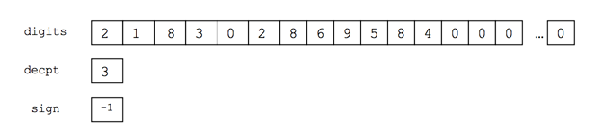
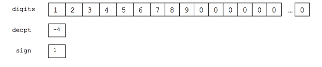

## 문제

상근이는 구조체를 이용해서 실수를 저장하려고 한다. 구조체에는 30개의 숫자를 저장할 수 있는 정수 배열 (digits), 소수점의 위치를 나타내는 정수 (decpt), 부호(+/-)를 나타내는 sign이 있다. 예를 들어, -218.302869584는 아래와 같이 저장할 수 있다.

0.0000123456789는 아래와 같이 저장할 수 있다.

실수가 주어졌을 때, 상근이가 만든 방법을 이용해 합을 구하는 프로그램을 작성하시오.

## 입력

첫째 줄에 테스트 케이스의 개수가 주어진다. 각 테스트 케이스는 여러 개의 실수로 이루어져 있으며, 각 테스트 케이스의 마지막에는 0이 주어진다. 입력으로 주어지는 실수는 최대 30개의 숫자로 이루어져 있고, 각 테스트 케이스는 최대 100개의 실수로 이루어져 있다.

## 출력

각 테스트 케이스마다 입력으로 주어진 실수의 합을 출력한다. 각 실수를 출력할 때, 0이 아닌 마지막 자리까지 출력한다. 절대로 반올림을 하면 안 된다.
