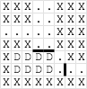

## 문제

Evacuation missions and supply gathering missions are conducted on a regular basis by special teams. One of the first objectives of these missions is to set up a perimeter with barricades. Barricades are costly and take time to set up, so it is important to reduce the number of barricades necessary to block off an area.

You will be provided with several maps of high-interest drop zones. It is your job to write a program that will output the minimum number of barricades required for each drop zone.

Zombies will begin their approach from outside the map, thus any open area on the border is accessible to zombies. Barricades can be placed between any two adjacent open areas (including the drop zone) to block zombie movement. All zones outside of the map should be considered open areas.

Here is an example of one of the maps you will be provided:

```

XXX..XXX
XXX..XXX
.....XXX
XXX..XXX
XDDDD.XX
XDDDD...
XXXXXXXX
```

Legend:

| Symbol | Description |
| --- | --- |
| `X` | Impassible, zombies cannot move through these areas |
| `.` (period) | Open area, zombies can move through these zones, but not diagonally. Barricades may be placed between these areas. |
| `D` | Drop zone, this zone must be protected at all costs. Barricades must effectively block zombie movement from the edges of the map to this zone. This area is treated like an open area for zombie movement and barricade placement. There will be exactly one contiguous drop zone in every map. Drop zones may be on the edges of the map. |

Example barricade configuration:



Solution: 3

## 입력

The first number, N (1 <= N <= 20), will be the number of maps. For each map, there will be two parameters, R and C (1 <= R, C <= 150), denoting the number of rows and columns in the map, followed by the map itself as described above. Each row will be on its own line and all rows will have the same number of characters equal to C.

## 출력

For each map, print a single line containing the minimum number of barricades required to block off the drop zone.
