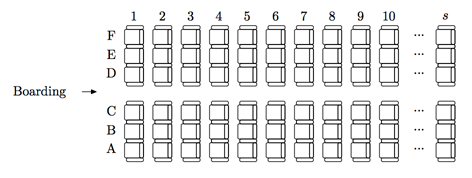

## 문제

Peter is an executive boarding manager in Byteland airport. His job is to optimize the boarding process. The planes in Byteland have s rows, numbered from 1 to s. Every row has six seats, labeled A to F.

There are n passengers, they form a queue and board the plane one by one. If the i-th passenger sits in a row ri then the difficulty of boarding for him is equal to the number of passengers boarded before him and sit in rows 1 . . . ri−1. The total difficulty of the boarding is the sum of difficulties for all passengers. For example, if there are ten passengers, and their seats are 6A, 4B, 2E, 5F, 2A, 3F, 1C, 10E, 8B, 5A, in the queue order, then the difficulties of their boarding are 0, 0, 0, 2, 0, 2, 0, 7, 7, 5, and the total difficulty is 23.

To optimize the boarding, Peter wants to divide the plane into k zones. Every zone must be a continuous range of rows. Than the boarding process is performed in k phases. On every phase, one zone is selected and passengers whose seats are in this zone are boarding in the order they were in the initial queue.

In the example above, if we divide the plane into two zones: rows 5–10 and rows 1–4, then during the first phase the passengers will take seats 6A, 5F, 10E, 8B, 5A, and during the second phase the passengers will take seats 4B, 2E, 2A, 3F, 1C, in this order. The total difficulty of the boarding will be 6.

Help Peter to find the division of the plane into k zones which minimizes the total difficulty of the boarding, given a specific queue of passengers.

## 입력

The first line contains three integers n (1 ≤ n ≤ 1000), s (1 ≤ s ≤ 1000), and k (1 ≤ k ≤ 50; k ≤ s). The next line contains n integers ri (1 ≤ ri ≤ s).

Each row is occupied by at most 6 passengers.

## 출력

Output one number, the minimal possible difficulty of the boarding.
