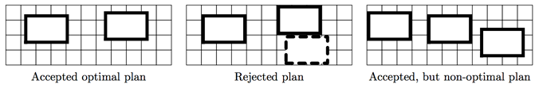

## 문제

Wow! What a lucky day! Your company has just won a social contract for building a garage complex. Almost all formalities are done: contract payment is already transferred to your account.

So now it is the right time to read the contract. Okay, there is a sandlot in the form of W × H rectangle and you have to place some garages there. Garages are w × h rectangles and their edges must be parallel to the corresponding edges of the sandlot (you may not rotate garages, even by 90◦). The coordinates of garages may be non-integer.

You know that the economy must be economical, so you decided to place as few garages as possible. Unfortunately, there is an opposite requirement in the contract: placing maximum possible number of garages.

Now let’s see how these requirements are checked. . . The plan is accepted if it is impossible to add a new garage without moving the other garages (the new garage must also have edges parallel to corresponding sandlot edges).

Time is money, find the minimal number of garages that must be ordered, so that you can place them on the sandlot and there is no place for an extra garage.

## 입력

The only line contains four integers: W, H, w, h — dimensions of sandlot and garage in meters. You may assume that 1 ≤ w ≤ W ≤ 30 000 and 1 ≤ h ≤ H ≤ 30 000.

## 출력

Output the optimal number of garages.

## 힌트

The plan on the first picture is accepted and optimal for the first example. Note that a rotated (2 × 3) garage could be placed on the sandlot, but it is prohibited by the contract.
