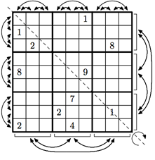

## 문제

Erast Kopi is famous Sudoku puzzle designer. Resounding success of his puzzle compilations caused a number of imitations and plagiarisms. Prior to sending a lawsuit he decided to get more evidence.

Sudoku puzzle is a table 9 × 9, divided into 3 × 3 subtables of 3 × 3 cells each. Each cell may contain a digit from 1 to 9. The task is to fill empty cells with digits in a way that each row, each column and each of the 9 subtables 3 × 3 contains each digit from 1 to 9 exactly once.

Kopi has a database of Sudoku puzzles and he wants to check if it contains similar puzzles. The puzzle P is similar to the puzzle Q, if it is possible to transform the puzzle P into the puzzle Q using a sequence of the following operations:

* choose two digits x and y and replace all digits x with y and vice versa;
* swap two triples of rows: (1, 2, 3), (4, 5, 6), (7, 8, 9);
* swap two rows in one triple of rows;
* swap two triples of columns: (1, 2, 3), (4, 5, 6), (7, 8, 9);
* swap two columns in one triple of columns;
* flip along top-left — bottom-right axis. After this operation columns become rows and vice versa.

Help Kopi to find similar puzzles in his database.

## 입력

The first line of the input contains single integer n — the number of puzzles in the database (1 ≤ n ≤ 20).

The rest of the input contains description of n puzzles: P1, P2, . . . , Pn. Each puzzle is described by nine lines that contain nine characters each. Each character is either a digit from 1 to 9, or a dot (‘.’) denoting an empty cell. An empty line separates consecutive puzzles in the database.

There are no spaces in the input file.

The puzzles are not guaranteed to be solvable.

## 출력

Check if the puzzle P1 is similar to puzzles P2, P3, . . . , Pn (in this order), than check if the puzzle P2 is similar to puzzles P3, P4, . . . , Pn (in this order) and so on.

If the puzzle Pi is similar to the puzzle Pj (1 ≤ i < j ≤ n) output “Yes”, otherwise output “No”. If the answer is positive, the next line should contain an integer qij — the number of operations required to transform the puzzle Pi to the puzzle Pj . The number of operations is not required to be minimal, however it must not exceed 1000. In the following qij lines write the operations that transform the puzzle Pi to the puzzle Pj , one per line.

Operations are encoded in the following way:

* “D x y” for swapping digits x and y;
* “R a b” for swapping triples of rows (3a − 2, 3a − 1, 3a) and (3b − 2, 3b − 1, 3b);
* “r a b” for swapping rows a and b, rows must belong to same triple of rows;
* “C a b” for swapping triples of columns (3a − 2, 3a − 1, 3a) and (3b − 2, 3b − 1, 3b);
* “c a b” for swapping columns a and b, columns must belong to same triple of columns;
* “F” for flipping along top-left — bottom-right axis.

The columns are numbered from left to right and the rows are numbered from top to bottom as they are given in the input file, starting from one.
