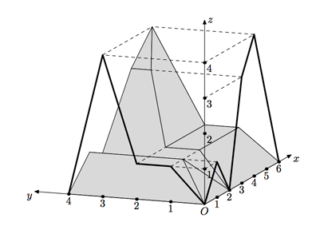

## 문제

> “This was made by Thror, your grandfather, Thorin”, he said in answer to the dwarves’ excited questions. “It is a plan of the Mountain.”
>
> ---
>
> J. R. R. Tolkien. The Hobbit, or There and Back Again

The plan of the Lonely Mountain consists of two parallel projections of the mountain to two projection planes. Both planes are perpendicular to the ground and each other. Each projection has a mountain-like shape.

Since Bilbo Baggins has never seen the mountain, he tries to imagine it. Is it really the Lonely Mountain or some ridges and other mountains surround it? In any case, it must be tremendous to hold the whole dwarves’ kingdom!

Bilbo decided to estimate the maximum possible volume of the Lonely Mountain and nearby mountains (if any) based on the plan provided by Gandalf.

## 입력

The first line contains single integer number nx — the number of points in the parallel projection of the mountain to the plane Oxz (2 ≤ nx ≤ 100 000). The second line contains nx pairs of integer numbers xi, zi — the coordinates of the polygonal chain, representing the projection (−109 ≤ x1 < x2 < x3 < · · · < xnx ≤ 109; 0 ≤ zi ≤ 109; z1 = znx = 0).

The following two lines contain projection to the Oyz plane in the same format.

## 출력

The only line of the output file must contain a single number V — the maximum possible volume of the Lonely Mountain.

The absolute or relative precision of you answer should be at least 10−6. E.g. if V′is the actual maximum possible volume, the following must hold: min(|V−V′|,|V−V′|/V′) ≤ 10−6.

If there are no mountains corresponding to the given projections, output a single line “Invalid plan”.
