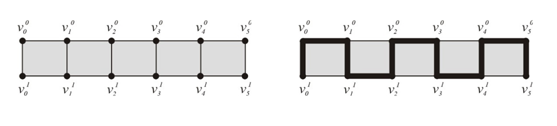
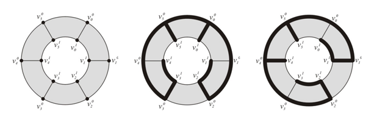

## 문제

인류는 선사시대부터 물체와 건물을 장식해왔다. 이러한 장식에서 가장 중요한 요소는 기하학문양이다. 우리는 일상생활 속에서 기하학문양을 손쉽게 찾아볼 수 있다.

유명한 계산 기하학 전문가 수환이는 기하학문양이 그리드와 다양한 서브 그리드 위에서 매우 정교하게 만들어졌다는 사실을 알게 되었다. 수환이는 최근에 기하학문양을 자동으로 만들어주는 연구 프로젝트를 시작했다.

수환이가 관심을 갖는 그리드는 직사각형 그리드와 원형 그리드이다. m × n 직사각형 그리드는 한 평면 위에 있는 정점과 간선이 직사각형을 이루는 그래프이다. 그래프의 각 행에 있는 정점의 수는 n개, 각 열에 있는 정점의 수는 m개이다. 그래프의 정점은 {vji : 0 ≤ i ≤ m-1, 0 ≤ j ≤ n-1} 으로, 간선은 {(vji, vqp) : |i - p| + |j - q| = 1} 으로 나타낼 수 있다. m × n 원형 그리드는 m × n 직사각형 그리드에 간선을 추가해 동그랗게 만든 그래프이다. 즉, 모든 0 ≤ i ≤ m-1에 대해서, (vn-1i, v0i)를 추가한 그래프이다. 2 × 6 직사각형 그리드와 원형 그리드는 아래 그림 1과 2에 나와있다.

많은 기하학문양은 그리드 상에서 스패닝 트리를 이루고 있다. 스패닝 트리는 사이클 없이 모두 연결된 그래프이며, 그래프의 모든 정점과 일부 간선으로 이루어져 있다. 수환이는 2 × n 그리드에서 만들 수 있는 서로 다른 스패닝 트리의 개수를 세보려고 한다. 그래프의 각 정점은 다른 정점과 모두 구분된다. 그림 2에 나와있는 두 스패닝 트리는 다른 경우로 세야 한다.

n이 주어졌을 때, 2 × n 직사각형 그리드와 2 × n 원형 그리드에서 만들 수 있는 스패닝 트리의 개수를 구하는 프로그램을 작성하시오.

**그림 1**. 2 × 6 직사각형 그리드와 스패닝 트리 한 개

**그림 2**. 2 × 6 원형 그리드와 서로 다른 스패닝 트리 두 개

## 입력

첫째 줄에 테스트 케이스의 개수 T가 주어진다. 각 테스트 케이스는 한 줄로 이루어져 있고, 정수 n이 하나 주어진다. (3 ≤ n ≤ 50,000)

## 출력

각 테스트 케이스마다 Rn을 10,007로 나눈 나머지와 Cn을 10,007로 나눈 나머지를 출력한다. Rn은 2 × n 직사각형 그리드에서 만들 수 있는 스패닝 트리의 개수, Cn은 2 × n 원형 그리드에서 만들 수 있는 스패닝 트리의 개수이다.
