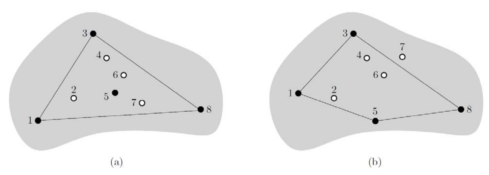

## 문제

Professor Octopus owns a large field which used to be golf course. The field still has many holes into which golf balls were to sink. Professor Octopus offers to sell you a part of his field at a fixed price. The part is determined as follows: you choose four holes in the golf field, and you get the part of the field bounded by the convex hull of the chosen holes. The convex hull of the chosen holes is the smallest convex polygon that contains all the chosen holes in its interior or boundary. We assume that the field is of uniform quality, so you would select four holes such that the area of their convex hull is maximized.

  
Figure 1

For example, Figure 1 (a) shows eight holes in the field. Imagine that you chose the four holes (black points) 1, 3, 5, and 8. Then any quadrilateral with corners at these four holes is not convex. So the convex hull of these four holes is just the triangle with corners at holes 1, 3, and 8 as shown in the figure. Moreover, it is not difficult to see that this triangle is the largest one among all possible convex hulls of four holes. Figure 1 (b) shows another example of a field with eight holes. In this example, the largest convex hull is the convex quadrilateral with corners at the four holes 1, 3, 5, and 8.

Given a set P of n points in the plane, you write a program to find four points of P whose convex hull has the largest area among all possible convex hulls defined by any four points of P.

## 입력

Your program is to read from standard input. The input consists of T test cases. The number of test cases T is given in the first line of the input. Each test case starts with an integer n, the number of points of a set P, where 4 ≤ n ≤ 30, 000. The next line contains a sequence of 2n integers, x1 y1 x2 y2 . . . xn yn, where xi and yi are the x-coordinate and y-coordinate of point pi of P, respectively. The coordinates are all integers with −1,000,000,000 ≤ xi ≤ 1,000,000,000 and −1,000,000,000 ≤ yi ≤ 1,000,000,000. Note that there are no three or more points of lying on a line.

## 출력

Your program is to write to standard output. For each test case, print the area of the largest convex hull determined by four points of P. Your output must contain the first digit after the decimal point, rounded off from the second digit.
