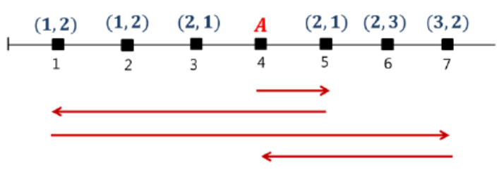

## 문제

A huge international event is being held every year. There is a long and wide street in front of the event hall. At the beginning of the event, the organizers set up flagpoles beside the street. They raise national flags on the flagpoles and rearrange them every year. This has became the symbol of the event.

The flagpoles are arranged on a line, with flagpole fi at location ℓi . The locations ℓi ’s have integer coordinates and they are all distinct. For the set of nations ℵ, the flag of a nation in ℵ is raised on a flagpole. In the last year, the flag of nation ai was raised on flagpole fi . At the first day of the new year, the nation bi whose flag is newly raised on the flagpole fi is determined.

The flag raised on the flagpole fi should be changed from ai to bi . This work is performed by a robot ℜ which lowers and raises the flags. The robot ℜ can carry an almost infinite number of flags. It may lower the flag of the nation ai on a flagpole fi and carry it. Then it may move to the location ℓj of flagpole fj such that bj = ai and raise the flag on fj . This work is always possible because the following condition is satisfied:

For each nation c ∈ ℵ, the number of flagpoles fi with ai = c is equal to the number of flagpoles fj with bj = c.

There is a special location A different from all ℓi ’s such that the robot ℜ should always start and end at A. At the location A, there is no flagpole. Therefore ℜ starts at A, delivers all flags of ai to flagpoles fj with bj = ai , and ends at A.

Given the location A and the locations of the flagpoles, and also given the nations ai and bi for each flagpolefi , write a program that computes the minimal travel distance of the robot ℜ to deliver all the flags.

For example, in Figure 1, there are six points, representing the flagpoles, and the special point A where the robot ℜ starts and ends. The nations of flags correspond to integers in the set {1, 2, 3}. At each point, a pair of integers (a, b) is given, where a and b are the nations of flags in the last year and in the new year, respectively. The arrows represent a movement of ℜ to minimize the travel distance. ℜ moves right from A to 5 to load the flag of the nation 2 of the point at 5. While moving left from 5 to 1, it delivers the flags of points at 3 and 5 to the points at 1 and 2, respectively. Then it moves right from 1 to 7 and delivers the flags of points at 1, 2, and 6 to the points at 3, 5, and 7, respectively. Finally, it delivers the flag of the point at 7 to the point at 6 and ends at A, while moving left from 7 to A. The travel distance of ℜ is 14.

  
Figure 1.

## 입력

Your program is to read from standard input. The input consists of T test cases. The number of test cases T is given in the first line of the input. Each test case starts with an integer N (2 ≤ N ≤ 100, 000), the number of points representing the flagpoles (not including A). The second line contains an integer α (1 ≤ α ≤ 1, 000, 000), the coordinate of A. The third line contains an integer M (1 ≤ M ≤ 1, 000), representing the set of nations {1, 2, . . . , M}. For each integer i = 1, . . . , M, at least one flag of the nation i is raised on a flagpole. The i-th line of the following N lines contains three integers ℓi , ai , and bi , the coordinate and the nation of the flag of flagpole fi in the last year and in the new year, respectively. Here 1 ≤ ℓi ≤ 1, 000, 000 (ℓi ≠ α) and 1 ≤ ai , bi ≤ M (ai ≠ bi). Also all ℓi ’s are distinct and given in a nondecreasing order.

## 출력

Your program is to write to standard output. Print exactly one line for each test case. The line should contain the minimum of the travel distance of the robot ℜ.
