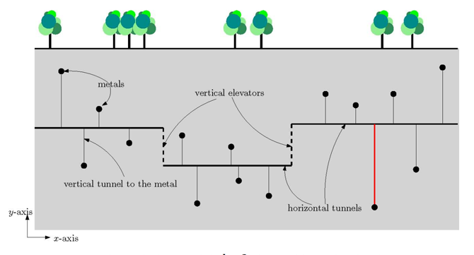

## 문제

매우 드물고 비싼 금속을 지하에서 찾아냈다. 금속은 땅 속에 넓게 흩어져 있기 때문에 신중하게 채굴 계획을 세우려고 한다. 따라서, 그림 1과 같이 수직 엘리베이터(vertical elevator)로 연결된 여러 개의 수평 터널(horizontal tunnel)을 만들기로 했다. 모든 엘리베이터는 한 터널의 오른쪽 끝과 다른 터널의 왼쪽 끝을 연결한다. 또, 터널과 엘리베이터의 연결 구조는 땅에 대해서 단조로워야 한다. 즉, 가장 왼쪽에 있는 터널의 끝에서 시작해서 가장 오른족에 있는 터널의 끝에 이동할 때, 다시 왼쪽으로 이동하는 일 없이 모든 터널을 지날 수 있어야 한다.

예산이 제한되어 있기 때문에, 수평 터널을 k개만 만들기로 했다. (k는 양의 정수) 따라서, 수평 터널을 연결할 수직 엘리베이터는 최대 k-1개 만들 수 있다. 이제, 수평 터널과 각각의 금속을 연결하는 수직 터널을 만들어야 한다. 한 금속을 채굴하는데 드는 비용은 수평 터널과의 수직 거리이다. 금속 n개를 채굴하는데 필요한 비용은 각 금속의 채굴 비용 중 최댓값이다.

그림 1. 금속이 15개, k=3인 경우의 채굴 계획. 이 계획에서 최대 거리는 오른쪽 빨간색으로 표시된 거리이고, 그 거리가 이 계획의 채굴 비용이다.

그림 1과 같이, 각 금속은 2차원 평면 위의 점으로 나타낼 수 있고, 수평 터널은 수평선, 수직 터널과 엘리베이터는 수직선으로 나타낼 수 있다. 점 n개 P = {p1, p2, ..., pn}와 양의 정수 k가 주어진다. 이때, 금속 pi를 채굴하는데 필요한 비용 cost(pi)은 수평 터널과 떨어진 수직 거리이다. P = {p1, p2, ... pn}의 채굴 비용 cost(P)는 모든 cost(Pi)중 최댓값 (max1≤i≤ncost(pi)) 이다. 이때, cost(P)를 최소로 만드는 (최대) k개 수평 터널의 위치를 결정해야 한다.

점 n개의 집합 P와 양의 정수 k가 주어졌을 때, cost(P)의 최솟값을 구하는 프로그램을 작성하시오.

## 입력

첫째 줄에 테스트 케이스의 개수 T가 주어진다. 각 테스트 케이스의 첫째 줄에는 점(금속)의 개수 n과 k가 주어진다. (2 ≤ n ≤ 10,000) 다음 줄에는 점 p1, p2, ..., pn의 좌표를 나타내는 정수 2n개 (x1, y1), (x2, y2), ..., (xn, yn)이 주어진다. (-100,000,000 ≤ xi, yi ≤ 100,000,000) 모든 좌표는 공백으로 구분되어 있고, 두 점이 같은 x좌표를 갖는 경우는 없다.

## 출력

각 테스트 케이스마다 cost(P)의 최솟값을 출력한다. 항상 소수점 둘째 자리에서 반올림해서 첫째 자리까지 출력한다.
