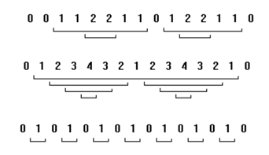

## 문제

Given a sequence of integers a1, a2, a3, …, an, an island in the sequence is a contiguous subsequence for which each element is greater than the elements immediately before and after the subsequence. In the examples below, each island in the sequence has a bracket below it. The bracket for an island contained within another island is below the bracket of the containing island.

Write a program that takes as input a sequence of 15 non-negative integers, in which each integer differs from the previous integer by at most 1, and outputs the number of islands in the sequence.

## 입력

The first line of input contains a single integer P, (1 ≤ P ≤ 1000), which is the number of data sets that follow. Each data set should be processed identically and independently.

Each data set consists of a single line of input. It contains the data set number, K, followed by 15 non-negative integers separated by a single space. The first and last integers in the sequence will be 0. Each integer will differ from the previous integer by at most 1.

## 출력

For each data set there is one line of output. The single output line consists of the data set number, K, followed by a single space followed by the number of islands in the sequence.
