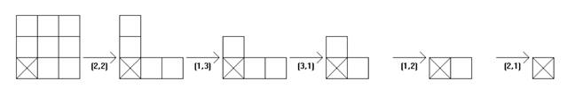

## 문제

Chomp is a two-player strategy game played on a rectangular chocolate bar made up of smaller square blocks (cells). The players take turns choosing one block and "eating it" (removing it from the board), together with those that are above it and to its right. The bottom left block is poisoned and the player who is forced to eat it loses. The following diagram shows a game beginning with a 3-by-3 board. The X indicates the poisoned cell.

A position in the game is a winning position if there is a move that results in a losing position for the opponent. A position in the game is a losing position, if every move from that position either eats the poisoned square (losing the game) or results in a winning position for the opponent.

In the example above, the 1x1 and equal armed L-shaped positions are losing positions (since the opponent can mirror the current player).

The 3x3, unequal armed L and 1xn positions are winning positions.

The aim of this problem is to "solve" 3-by-100 Chomp.

That is, for each possible position, determine whether it is a winning or losing position and if it is winning position, give the next move. A position in 3-by-100 Chomp, is determined by the number, p, of squares in the bottom row, the number, q, of squares in the middle row and the number, r, of squares in the top row with:

100 >= p >= q >= r >= 0

Write a program which, for each possible position in the 3 by 100 game of Chomp, determines whether it is a winning or losing position and if it is a winning position, gives the next move (the square to eat next).

## 입력

InputThe first line of input contains a single integer P, (1 ≤ P ≤ 1000), which is the number of data setst hat follow. Each data set should be processed identically and independently.

Each data set consists of a single line of input. It contains the data set number, K, followed by the counts 100 >= p >= q >= r >= 0 of squares in the bottom row (p), middle row (q) and top row (r) respectively separated by single spaces.

## 출력

For each data set there is a single line of output. If the input position is a losing position, the output line consists of the data set number, K, followed by a single space followed by the (capital) letter L. Otherwise (the input position is a winning position), the output line consists of the data set number,K, followed by the (capital) letter W, followed by the column number and row number of a block to eat which results in a losing position for the next player.
