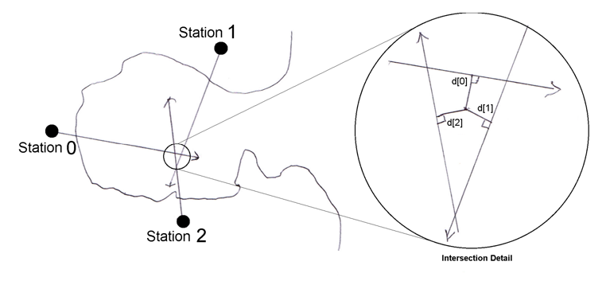

## 문제

It has been reported that something fell out of an aircraft approaching the airport over the bay. Thinking the object may have been some sort of contraband to be picked up by a confederate, the police want to watch for a repeat whenever any of the aircraft that could have been the one that dropped the object again approaches the airport over the bay. Three observation stations with night vision equipment have been stationed around the bay (see figure below).

Station 1 is 3.715 kilometers east and 1.761 kilometers north of station 0 and station 2 is 2.894 kilometers east and 2.115 kilometers south of station 0.

When a suspect aircraft crosses the bay, each observer follows it with the night vision equipment while in contact with the others. If any observer sees something falling from the aircraft, each records a direction to the object and a confidence level for that direction. The confidence level (CL) is a value from 0 (more or less pointing at the aircraft) to 1 (pointing at the splash where the object hit the water).

In general, the three sight lines will not cross at a single point but will form a triangle (see Intersection Detail above). The best estimate of the actual position is to be the point (x, y) which minimizes the sum of the squares of the distances, d[i], to each line, weighted by the confidence level, CL[i] +0.2,

Minimize SUM(i = 0 to 2) {(CL[i] + 0.2) \* d[i]2}

For this problem, you will write a program which takes as input the three observer directions and the three confidence levels and outputs the point (x, y), which minimizes the above sum, where x is the distance in kilometers east of station 0 and y is the distance in kilometers north (positive) or south (negative) of station 0.

## 입력

The first line of input contains a single integer P, (1 ≤ P ≤ 1000), which is the number of data sets that follow. Each data set should be processed identically and independently.

Each data set is a single line of input consisting of the data set number N, followed by a space,followed by six space separated floating point values. The floating point values are, in order, a[0], CL[0], a[1], CL[1], a[2], CL[2]. a[i] is the bearing (in degrees clockwise from north) from station i(0 ≤ a[i] < 360), and CL[i] is the confidence level of observer i (0 ≤ CL[i] ≤ 1).

## 출력

For each data set there is one line of output. It contains the data set number, N, followed by a single space which is then followed by two space separated values, x and y. x is the distance east of station 0 in kilometers, and y is the distance north (positive) or south (negative) of station 0. The distances should be displayed to 3 decimal places.
