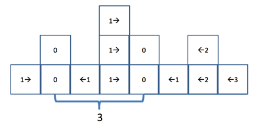
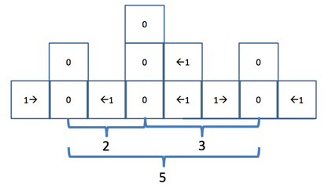

## 문제

도영이는 블록들의 스택을 가지고 노는 것을 좋아한다. 도영이는 그 블록들을 산으로 취급하고, 자신만의 지형물을 만들기를 즐긴다. 최근, 도영이는 블록을 재배열하는 데 제약을 하나 걸었다. 먼저, 도영이는 모든 스택을 일렬로 늘어세운다. 그리고, 한 번에 하나의 블록만을 옮길 수 있다. 이 일은 두 인접한 스택 중 제일 위에 있는 하나의 블록을 반대쪽 스택으로 옮기는 것을 말한다.

도영이는 항상 이 과정을 거쳐서 블록을 재배열한다. 이제 도영이는 지금까지 만들지 않았던 가장 **아름다운 강산**을 만들려고 한다. 도영이는 가능한 모든 두 산의 쌍을 골랐을 때, 두 산 사이의 거리가 소수일 경우(꼭 인접하지 않은 경우라도)에 그 강산이 아름답다는 것을 알았다. 만약 강산이 하나의 산으로 이루어져 있다면, 그것도 아름다운 강산이다. 산은 하나 이상의 블록을 가지고 있는 스택이다.

위 그림은 블록들의 처음 상태를 나타낸다. 산을 "0" 값들이 쌓여 있는 스택 2개로 결정했다면, 이제 아름다운 강산을 만들기 위해 모든 블록을 가까운 산으로 하나씩 옮겨 가려면 최소 13번의 행동이 필요하다. 그러나 산을 아래 그림과 같이 3개로 정한다면, 6번의 행동만으로 아름다운 강산을 만들 수 있다.

현재 블록들의 상태가 주어질 때, 도영이가 아름다운 강산을 만드는 데 필요한 최소 횟수의 움직임을 구하시오.

## 입력

첫 번째 줄에는 테스트 케이스의 개수가 주어지며, 다음 줄부터 테스트 케이스가 차례대로 주어진다. 각 테스트 케이스의 첫 줄에는 스택의 개수 n(1≤n≤30,000)이 주어진다. 다음 줄에는 n개의 정수 b(0≤b≤1,000)가 주어지며, 이는 각각 스택의 블록 개수를 나타낸다. 각 정수들은 하나의 공백으로 구분되며, 줄의 맨 처음이나 맨 끝에는 공백이 없다. 스택에 블록이 0개가 있더라도 정수 b로 표기됨을 주의하라. 입력의 맨 끝에는 0 하나가 주어진다.

## 출력

각각의 테스트 케이스에 대해서, 도영이가 아름다운 강산을 만드는 데 필요한 최소 움직임 횟수를 한 줄에 하나씩 출력한다. 공백이나 빈 줄을 출력하지 않는다.
