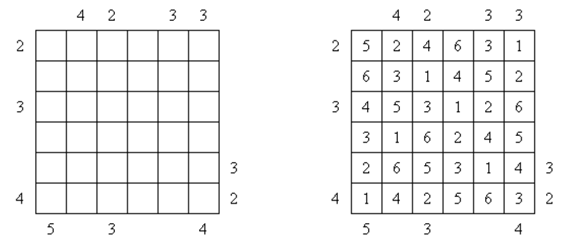

## 문제

Skyscrapers is a pencil puzzle. It’s played on a square nxn grid. Each cell of the grid has a building. Each row, and each column, of the grid must have exactly one building of height 1, height 2, height 3, and so on, up to height n. There may be numbers at the beginning and end of each row, and each column. They indicate how many buildings can be seen from that vantage point, where taller buildings obscure shorter buildings. In the game, you are given the numbers along the outside of the grid, and you must determine the heights of the buildings in each cell of the grid.

Consider a single row of a puzzle of size nxn. If we know how many buildings can be seen from the left, and from the right, of the row, how many different ways are there of populating that row with buildings of heights 1..n?

## 입력

There will be several test cases in the input. Each test case consists of three integers n a single line: n (1≤n≤5,000), left (1≤left≤n), and right (1≤right≤n), where n is the size of the row, and left and right are the number of buildings that can be seen from the left and right, respectively. The Input will end with a line with three 0s.

## 출력

For each test case, print a single integer indicating the number of permutations which satisfy the constraints, modulo 1,000,000,007 (that’s not a misprint, the last digit is a seven). Output no extra spaces, and do not separate answers with blank lines.
