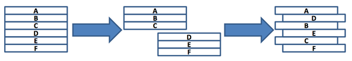

## 문제

A Perfect Shuffle of a deck of cards is executed by dividing the deck exactly in half, and then alternating cards from the two halves, starting with the top half.

Given a deck of cards, perform a Perfect Shuffle. If there is an odd number of cards, give the top half split one more card than the bottom half.

## 입력

There will be several test cases in the input. Each test case will begin with a line with a single integer n (1≤n≤1,000), indicating the number of cards. On each of the next n lines will be a string from 1 to 80 characters in length, which is the name of a card. It will contain only capital letters and dashes. Within a test case, all card names will be unique. Input will end with a line with a single 0.

## 출력

For each test case, output n lines, consisting of the deck after a perfect shuffle. Output no extra spaces. Do not print a blank line between answers.
