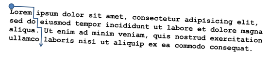

## 문제

Take some text. Put a small ball at the top of the first letter of the first word of the first sentence. The ball is drawn via gravity downwards. The text is also at a slight angle, so the ball wants to also move towards the right. The ball can freely move between the lines, and can drop through spaces. Considering the first column to be column 1, what column will the ball end up in? In this example, the ball ends up in column 8.

## 입력

There will be several test cases in the input. Each test case will begin with an integer n (1≤n≤1,000) on its own line, indicating the number of lines of text. On each of the next n lines will be text, consisting of printable ASCII characters and spaces. There will be no tabs, nor any other unprintable characters. Each line will be between 1 and 100 characters long. The input will end with a line containing a single 0.

## 출력

For each test case, output a single integer on its own line, indicating the column from which the ball will drop. Output no spaces, and do not separate answers with blank lines.
