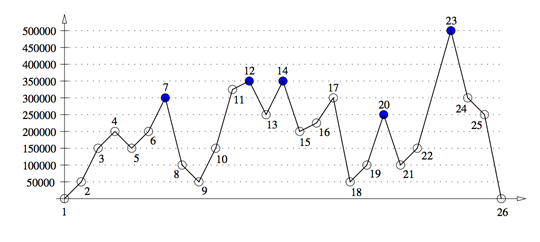

## 문제

The topographic prominence of a peak is a measure of special interest to mountain climbers and can be defined as follows: the prominence of a peak p with altitude h, relative to the sea level, is the greatest d such that any path on the terrain from p to any strictly higher peak will pass through a point of altitude h − d. If there is no strictly higher peak, then the prominence is h itself. Those peaks with topographic prominence greater than or equal to 150000 centimeters (precision is of great importance to climbers!) have a special name: they are called “Ultras”.

You have to write a program that identifies all the Ultras that occur in a two dimensional profile of a mountain range represented as a sequence of points. Note that the horizontal distance between points is not important; all that you need is the altitude of each point. In the picture below, the Ultras are the points 7, 12, 14, 20 and 23.

## 입력

The first line contains an integer N (3 ≤ N ≤ 105) representing the number of points in the profile. The second line contains N integers Hi indicating the altitudes (in centimeters) of the points, in the order in which they appear in the profile (0 ≤ Hi ≤ 106 for i = 1, 2, ... , N). Consecutive points have different altitudes (Hi ≠ Hi+1 for i = 1, 2, ... , N − 1), while the first and the last points are at sea level (H1 = HN = 0). You may assume that the profile contains at least one Ultra.

## 출력

Output a line with the indices of all the Ultras in the mountain range, in the order in which they appear in the profile.
