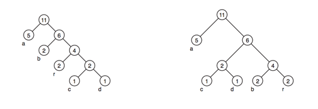

## 문제

Static Huffman coding is an encoding algorithm used mainly for text compression. Given a text of certain size made of N different characters, the algorithm chooses N codes, one for each different character. The text is compressed using these codes. To choose the codes, the algorithm builds a binary rooted tree having N leaves. For N ≥ 2 the tree can be built as follows.

1. For each different character in the text build a tree containing just a single node, and assign to it a weight coincident with the number of occurrences of the character within the text.
2. Build a set s containing the above N trees.
3. While s contains more than one tree:
   1. Choose t1 ∈ s with minimum weight and remove it from s.
   2. Choose t2 ∈ s with minimum weight and remove it from s.
   3. Build a new tree t with t1 as its left subtree and t2 as its right subtree, and assign to t the sums of the weights of t1 and t2.
   4. Include t into s.
4. Return the only tree that remains in s.

For the text “abracadabra”, the tree produced by the above procedure can look like the one on the left of the following picture, where each internal node is labeled with the weight of the subtree rooted at that node. Notice that the obtained tree can also look like the one on the right of the picture, among others, because at steps 3a and 3b the set s may contain several trees with minimum weight.

For each different character in the text, its code depends on the path that exists, in the final tree, from the root to the leaf corresponding to the character. The length of the code is the number of edges in that path (which is coincident with the number of internal nodes in the path). Assuming the tree on the left was built by the algorithm, the code for “r” has length 3 while the code for “d” has length 4.

Your task is, given the lengths of the N codes chosen by the algorithm, find the minimum size (total number of characters) that the text can have so as the generated codes have those N lengths.

## 입력

The first line contains an integer N (2 ≤ N ≤ 50) representing the number of different characters that appear in the text. The second line contains N integers Li indicating the lengths of the codes chosen by Huffman algorithm for the different characters (1 ≤ Li ≤ 50 for i = 1, 2, ... , N). You may assume that there exists at least one tree, built as described, that produces codes with the given lengths

## 출력

Output a line with an integer representing the minimum size (total number of characters) that the text can have so as the generated codes have the given lengths.
