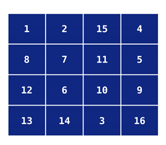
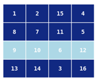
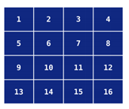

## 문제

A new puzzle which aims to conquer the game market is a fusion of Rubik’s Cube and Fifteen. The board is an H × W frame with tiles with all numbers from 1 to H · W printed on them.

The only type of move that is allowed is flipping either one of the rows or one of the columns. Flipping reverses the order of the row’s (or column’s) elements. Below the third row is flipped:

You are given a board with tiles numbered in some arbitrary order. Determine a sequence of flips that brings the board to the nicely sorted position, if possible.

## 입력

The first line of input contains the number of test cases T. The descriptions of the test cases follow:

The description of each test case starts with an empty line. The next line contains two space-separated integers W and H (1 ¬ W, H ¬ 100) – the width and height of the puzzle, respectively. Each of the next H lines contains W space-separated integers – the numbers printed on consecutive tiles.

## 출력

Print the answers to the test cases in the order in which they appear in the input. Start the output for each test case with the word POSSIBLE or IMPOSSIBLE, depending on whether it is possible to solve the puzzle. If a solution exists, print (in the same line) first the number of moves (possibly 0) and then their descriptions, each consisting of a single letter R or C specifying whether we are to flip a row or a column, concatenated with the index of the row or column to flip.

Any solution will be accepted as long as it does not use more than 10 · W · H moves. Each test case is either solvable within this limit, or not solvable at all.
