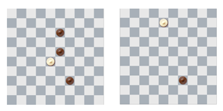

## 문제

Draughts (or checkers) is a game played by two opponents, on opposite sides of a 10 × 10 board. The board squares are painted black and white, as on a classic chessboard. One player controls the dark, and the other the light pieces. The pieces can only occupy the black squares. The players make their moves alternately, each moving one of his own pieces.

The most interesting type of move is capturing: if a diagonally adjacent square contains an opponent’s piece, it may be captured (and removed from the game) by jumping over it to the unoccupied square immediately beyond it. It is allowed to make several consecutive captures in one move, if they are all made with a single piece. It is also legal to capture by either forward or backward jumps.

The board before and after a single move with two captures.

You are given a draughts position. It is the light player’s turn. Compute the maximal possible number of dark pieces he can capture in his next move.

## 입력

The first line of input contains the number of test cases T. The descriptions of the test cases follow:

Each test case starts with an empty line. The following 10 lines of 10 characters each describe the board squares. The characters # and . denote empty black and white squares, W denotes a square with a light piece, B – a square with a dark piece.

## 출력

For each test case print a single line containing the maximal possible number of captures. If there is no legal move (for example, there are no light pieces on the board), simply output 0.
