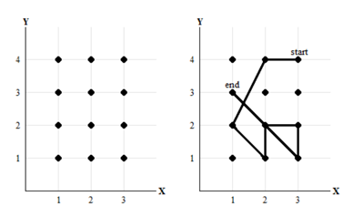

## 문제

휴대폰의 잠금 방법 중 가장 흔한 것이 잠금 패턴이다. 잠금을 해제하기 위해서는 주어진 점들을 적절한 방법으로 이어 정해진 모양을 만들어야 한다.

청호의 휴대폰은 4개의 행에 각각 3개의 점이 있는 형태의 잠금 패턴을 사용한다. 아래의 그림은 잠금 패턴의 예시로, 잠금 패턴은 아래와 같이 2차원 평면으로 모델링되며 각각의 점은 X좌표와 Y좌표를 갖는 정수 격자점으로 표현된다. 가장 왼쪽 위의 점이 (1,4)이며, 가장 오른쪽 아래의 점이 (3,1)이 된다.

위의 패턴을 좌표로 읽으면 (3,4) (2,4) (1,2) (2,1) (2,2) (3,2) (3,1) (1,3) 이 된다.

이제 '유효한 패턴' 을 다음과 같이 정의하자.

* 패턴은 그 패턴이 어떤 점을 처음 지나는 순간 그 점의 좌표를 표기하여 나열한 하나의 집합으로 나타낸다. 즉, 그려지는 순서대로 점을 표기하는 것이다. 이때, (1,1) (2,2)와 (2,2) (1,1)은 그려지는 순서가 다르므로 서로 다른 패턴이다.
* 패턴에 나타나는 임의의 연속된 두 점 A와 B에 대하여, A와 B를 잇는 선분 상에 있는 다른 점들은 패턴에 이미 출현했어야 한다. 예를 들어 (3,1) (1,3)은 유효하지 않은 패턴이지만, (3,1) (2,2) (1,3)이나 (2,2) (3,2) (3,1) (1,3)과 같은 패턴은 유효한 패턴이다.
* 패턴은 동일한 점을 두 번 이상 지날 수는 있지만, 동일한 점이 두 번 이상 언급되어선 안 된다. 각 점은 최초에 지날 때 한 번만 패턴 내의 점으로 취급된다.
* 패턴의 길이는 패턴 내의 모든 연속된 두 점 사이의 맨해튼 거리의 합으로 정의한다. 두 점 (X1, Y1), (X2, Y2)의 맨해튼 거리는 |X1 − X2| + |Y1 − Y2|로 정의된다.
* 패턴은 최소한 두 개의 점을 포함해야 한다.

어느 날 청호는 자기 휴대폰의 잠금 패턴을 잊어버렸다. 하지만 청호는 패턴의 길이 L과 패턴이 절대 지나지 않았던 점들의 집합 S를 기억한다. S에 포함되지 않는 점들은 지날 수도 있고 지나지 않을 수도 있다.

청호는 알고 있는 정보를 바탕으로 모든 경우의 수를 하나하나 시도해보려 한다. 하지만 그 전에, 몇 번이나 시도해야할 지 미리 계산해보고 시도하고 싶다. S와 L이 주어질 때, 서로 다른 유효한 패턴의 개수는 총 몇 개일까?

## 입력

첫 줄에 테스트 케이스의 수 T가 주어진다. ( 1 ≤ T ≤ 100 )

각 테스트 케이스의 첫 줄엔 L과 N이 주어진다. L은 패턴의 길이이며, N은 청호가 기억하는 절대 지나지 않았던 점들의 수이다. ( 1 ≤ L ≤ 1000 ) , ( 0 ≤ N ≤ 12 )

이어 N줄에 걸쳐 두 정수 X와 Y가 주어진다. ( 1 ≤ X ≤ 3 ), ( 1 ≤ Y ≤ 4 )

이는 패턴이 점 (X,Y)를 절대 지나지 않음을 의미한다.

N개의 점은 모두 다르다.

## 출력

각 테스트 케이스마다, 가능한 유효한 패턴의 총 개수를 출력한다.

만일 가능한 패턴이 한 개도 없다면 패턴의 개수 대신 BAD MEMORY를 출력한다.
