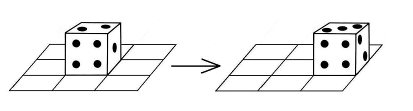

## 문제

You and your friends like to play chess and backgammon every day. But now you are bored of these games, and you would like to play a new game. So you decided to make your own game, which will be played using a backgammon die (singular of dice) on a board similar to the chess board, and it will be a single player game.

The game is played on a board of N rows and M columns. Each cell is either empty or contains a number from 0 to 9, and there is a single die (a die with six faces containing the numbers from 1 to 6) placed in one of the empty cells (the borders of the bottom face is aligned to the axes of the board), and your goal is to move it to a target empty cell.

The initial orientation of the die is defined by a string S which is a permutation of the digits from 1 to 6. Each digit represents the number written on a face of the die according to this order: right, left, forward, backward, top, bottom. Moving the die is defined by the following rules:

You can move the die from a cell to one of its four adjacent cells by flipping it on the corresponding face. For example, if the current orientation of the die is 136425 and you will move it to the cell on its right, you should flip the die on its right face and it will become the bottom face in the right cell, so the orientation of the die will be 256431. (This is the example in the figure).  
Your score is initially zero. By moving the die to another cell, if the number on the bottom face is the same as the number in the cell you just moved to, your score will be increased by the sum of these two numbers, otherwise your score will be decreased by the sum of these two numbers. Entering the target cell will not affect your score.  
You can not leave the board.  
Once you leave the starting cell, you can not enter it again.  
Once you enter the target cell, you can not leave it.  
You can not enter an empty cell, except the target one.

Given the board configuration, the starting cell, the target cell and the die’s initial orientation, your task is to move the die from the starting cell to the target cell according the rules above, such that you end up with the maximum possible score. Can you write a program to help you?

## 입력

Your program will be tested on one or more test cases. The first line of the input will be a single integer T, the number of test cases (1 ≤ T ≤ 200). After that follow the specifications of T test cases.

Each test case is specified in N + 2 lines. The first line contains two integers N and M (1 ≤ N, M ≤ 10) representing the number of rows and number of columns of the board, respectively. The second line contains the string S representing the initial orientation of the die in the starting cell as described above. Each line of the remaining N lines contains M characters, the j-th character in the i-th line represents the value of the j-th cell in the i-th row of the board. Each character will be one of the following values:

1. '.' means an empty cell.
2. 'S' means the starting cell (which will appear exactly once in the board).
3. 'T' means the target cell (which will appear exactly once in the board).
4. A digit from '0' to '9' means the value written in this cell.

## 출력

For each test case, output, on a single line, one of these values:

1. "Impossible" if you can not reach the target cell from the starting cell.
2. "Infinity" if there is no limit for your final score, and you can increase it with no limit.
3. Otherwise, output the maximum score which you can get.
