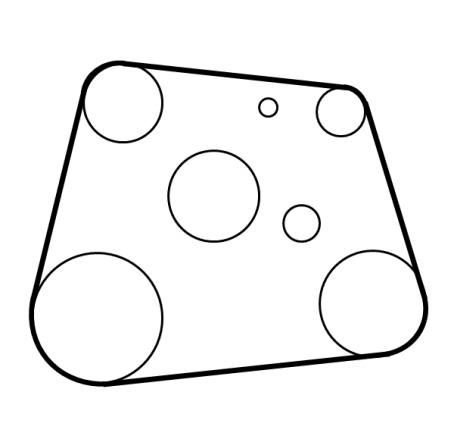

## 문제

You have a garden with trees and goats. Since you like to protect the trees from the goats, you decided to build a single fence around the trees, and you like this fence to be as short as possible.

In the top view of your garden trees can be modeled by circles in 2D space. In this view, the required fence will be a 2D shape that touch some or all of the trees, such that all the trees are inside this shape. For example, in the figure, the trees are shown as the circles, and the shortest possible fence is shown as the bold surrounding line.

## 입력

Your program will be tested on one or more test cases. The first line of the input will be a single integer T, the number of test cases (1 ≤ T ≤ 250). After that follow the specifications of T test cases.

Each case is specified in N + 1 lines. Each case starts with a line containing an integer N, the number of trees in the garden (1 ≤ N ≤ 100), followed by N lines, each in the format "X Y R", where X and Y are the 2D coordinates of the center of the tree, and R is the radius of the tree.

X, Y , and R are all integers between 1 and 1,000, inclusive. No trees in the input touch or intersect each other.

## 출력

For each test case, output, on a single line, a single number representing the minimum length of the shortest possible fence that can surround all the trees, rounded to five decimal places.
