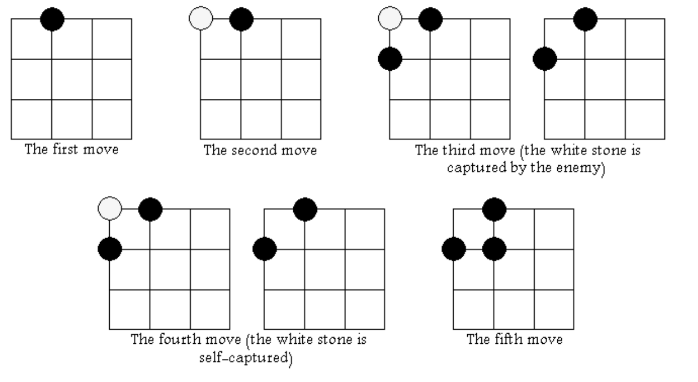

## 문제

Go is an ancient board game for two players that originated in China over 2,000 years ago. The game is notably known for being rich in strategy despite its relatively simple rules.

The game is played by two players who alternately place black and white stones on the vacant intersections of a grid of N × N orthogonal lines. The objective of the game is to use one’s stones to make a larger territory than the opponent.

The horizontal lines are numbered from top to bottom by the numbers from 1 to N, and the vertical lines are numbered from left to right by the numbers from 1 to N.

Two intersections or stones are adjacent if one of them is adjacent to the other, from right, left, top or bottom. A “solidly connected group” is a set of intersections or stones in which every pair is connected by a path of adjacent intersections or stones from the same set.

A solidly connected group of empty intersections or stones is called surrounded by a color, if all the adjacent intersections to the group are occupied by stones of that color.

A player’s territory consists of all the intersections occupied by the player’s stones, in addition to the solidly connected groups of empty intersections surrounded by the player’s stone color.

Here is a list of the rules for a simplified version of the game:

1. The board is empty at the beginning of the game.
2. Each player has stones of one color (black or white).
3. Black gets the first turn, then the players alternate turns.
4. A move consists of placing one stone of one’s own color on an empty intersection on the board.
5. A player may pass his turn at any time and give the turn to the other player.
6. A solidly connected group of stones of one color is captured and removed from the board once it is surrounded by the opponent.
7. Self-capture happens when your move causes some of your stones to be captured and thus removed.
8. In case of a move causing a group from both players to be captured, capture of the opponent takes precedence over self-capture.

You are given the size of the board and a sequence of moves, and your task is to validate this sequence of moves and print the index (1-based) of the first invalid move (a move is invalid if the player is trying to put a stone in a non-empty intersection). If all moves are valid you should print the sizes of the territories for each player after the last move.

## 입력

Your program will be tested on one or more test cases. The first line of the input will be a single integer T, the number of test cases (1 ≤ T ≤ 100). After that follow the specifications of T test cases.

Each test case is specified on S + 1 lines. The first line contains two integers N and S representing the size of the board and the number of moves to validate, respectively (1 ≤ N ≤ 20, 1 ≤ S ≤ 1, 000). Each line of the remaining S lines will contain either two zeros which means a pass turn, or two integers R and C specifying the horizontal and vertical line numbers of the player’s move (1 ≤ R, C ≤ N).

## 출력

For each test case, output, on a single line, one of two outputs:

* "Invalid X", if there is at least one invalid move, where X is the index of the earliest invalid move. Please note that passing the turn to the other player does not count as a move.
* "B W", if there are no invalid moves, where B and W are the sizes of the black and white territories, respectively.

## 힌트

Explanation for the second test case
