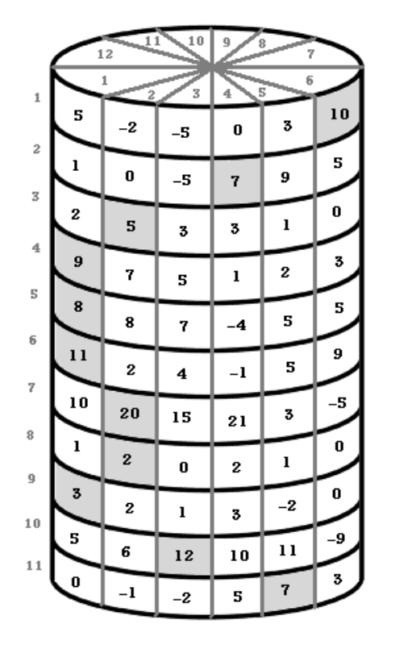

## 문제

The cylinder game is new and not published anywhere yet. The inventor of this game is interested in writing a solver for the game before publishing it, and he needs your help to write this solver.

The game is played on a cylinder. This cylinder is divided into N rows numbered from 1 to N (the first row is the top-most one), and each row is divided into M cells numbered from 1 to M, and each cell contains a number. The cell number 1 is adjacent to the cell number M in the same row (check the image for more clarification).

Each cell will be defined by two numbers X and Y , where X is the row number and Y is the cell number in this row. The distance between two cells (X1, Y1) and (X2, Y2) is the absolute difference between X1 and X2 added to the minimum of (the absolute difference between Y1 and Y2) and (M - the absolute difference between Y1 and Y2).

The first step in the game is to select any cell from the first row to start from, then you will move from the current cell to any cell in the next row, without exceeding a distance of K. You will keep doing this move until you reach the last row. Your final score will be the sum of the numbers inside the cells you selected in your steps. The goal of the game is to maximize this score.

Can you help by writing a solver for this game?

## 입력

Your program will be tested on one or more test cases. The first line of the input will be a single integer T, the number of test cases (1 ≤ T ≤ 100). After that follow the specifications of T test cases.

Each case is specified on N +1 lines. The first line of a case contains three integer N, M and K, representing the number of rows, number of cells in each row and the maximum allowed distance in every move, respectively (1 ≤ N, M, K ≤ 1, 000).

Each line of the remaining N lines contains M numbers. The j-th number in the i-th line is the number in the cell (i, j). The absolute value of all the given numbers is at most 1, 000.

## 출력

For each test case, you must print one line of output that starts by the maximum score you can get, followed by a single space, followed by N numbers separated by single spaces, where the i-th number is the index of the selected cell in the row number i.

If there are multiple solutions that reach the same maximum score, you should print the lexicographically smallest one. (A solution X is defined as lexicographically smaller than a solution Y if X has a smaller number than Y at the first position where they differ).

## 힌트

This is the sample test case. The unviewable cells (behind) are all zeros, and the best solution is highlighted
