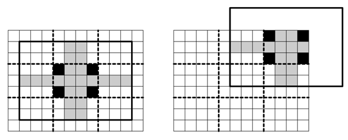

## 문제

Fili and Floi play a puzzle game. Fili takes a rectangular piece of paper that is lined with a W × H grid of square cells, cuts it into pieces on its grid lines, and carefully shuffles the pieces so that pieces do not rotate. Floi has to recombine the pieces back into the rectangle without rotating them.

Fili observes a number of constraints while cutting an original paper into pieces to make sure that the resulting puzzle is well-formed. First of all, Fili picks three integer numbers w, h, and n, so that an original rectangular paper has a width of W = wn cells and a height of H = hn cells. Here w and h are known to Floi, but n, W, and H are not. This way, the original rectangular piece of paper can be cut into a trivial puzzle of k = n2 rectangles with a width of w cells and a height of h cells each. However, this trivial puzzle for k > 1 is not considered a well-formed puzzle for this game. Instead, the pieces int which the original rectangle is cut are based on these trivial w × h cell rectangles with the jagged edges between the adjacent pieces. Formally, the pieces into which the original W × H paper is cut satisfy the following constraints of a well-formed puzzle:

* There are k = n2 pieces.
* Each piece is a simple 4-connected region of cells without holes.
* Each cell of the original rectangular W × H paper is a part of exactly one piece.
* Each piece contains four corners of the corresponding w × h rectangle in the trivial puzzle for the original paper.
* The cells of each piece can come only from the corresponding w × h rectangle in the trivial puzzle, from the cells adjacent to this rectangle, and from the interior cells of the adjacent rectangles in the trivial puzzle.
* The cut between two adjacent pieces cannot be straight. Only pieces that lie on the border of the original W × H paper have straight sides.

The corollary of these constraints is that each piece of a well-formed puzzle fits into a rectangle of (3w − 2) × (3h − 2) cells. Moreover, the description of each piece will be given as a (3w − 2) × (3h − 2) grid of cells in such a way, that the corresponding w × h rectangle of the trivial puzzle is exactly in the center.

The picture below to the left shows a sample rectangular piece of paper that is lined with a W×H = 12×9 square grid of cells and is cut into a trivial puzzle of k = 9 rectangles with a width of w = 4 cells and a height of h = 3 cells each with bold dashed lines. The corners of the central 3 × 4 piece of this trivial puzzle are shown in black. They have to be a part of the central piece of any well-formed puzzle. The other potential cells of the central piece of a well-formed puzzle are shown in gray. The bold black line shows (3w − 2) × (3h − 2) = 10 × 7 rectangular region that will be describing this central piece. The picture to the right shows the same for the piece in the upper-right corner of the puzzle.

Your task is to help Floi solve the puzzle.

## 입력

The first line of the input file contains there integers k, w and h. Here k is the number of pieces in the puzzle, w is a width and h is a height of a trivial puzzle piece (k = n2 for 1 ≤ n ≤ 4, 3 ≤ w, h ≤ 5). The rest of the input file contains descriptions of k pieces of a well-formed puzzle. Each piece is described by 3h − 2 lines that contain 3w − 2 characters each. Pieces are labeled with a consecutive English letters in uppercase (1st piece — ‘A’, 2nd piece — ‘B’, and etc). Each piece description uses only two characters on its 3h − 2 lines of 3w − 2 characters. The English letter corresponding to the piece denotes a cell that is a part of this piece, while ‘.’ (dot) character denotes a cell that is not.

Empty lines separate different pieces.

## 출력

The first line of the output file shall contain W and H — the size of the original piece of paper that was cut into the puzzle pieces. The following H lines shall contain W English letters each, describing the solution of the puzzle. Letters denote the cells that belong to the corresponding puzzle pieces. If there are multiple ways to solve the puzzle, then print any solution.
