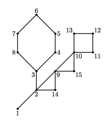

## 문제

NEERC had featured a number of problems in previous years about cactuses — connected undirected graphs in which every edge belongs to at most one simple cycle. Intuitively, cactus is a generalization of a tree where some cycles are allowed.

In 2005, the first year where problems about cactuses had appeared, the problem was called simply “Cactus”. In 2007 it was “Cactus Reloaded” and in 2010 it was called “Cactus Revolution”. An example of cactus from NEERC 2007 problem is given on the picture below.

The challenge that judges face when preparing test cases for those problems is that some wrong solutions may depend on the numbering of vertices in the input file. So, for the most interesting test cases judges typically include several inputs with the same graph, but having a different numbering of vertices. However, some graphs are so regular that the graph remains the same even if you renumber its vertices. Judges need some metric about the graph that tells how regular the given graph is in order to make an objective decision about the number of test cases that need to be created for this graph.

The metric you have to compute is the number of graph automorphisms. Given an undirected graph (V, E), where V is a set of vertices and E is a set of edges, where each edge is a set of two distinct vertices {v1, v2} (v1, v2 ∈ V ), graph automorphism is a bijection m from V onto V , such that for each pair of vertices v1 and v2 that are connected by an edge (so {v1, v2} ∈ E) the following condition holds: {m(v1), m(v2)} ∈ E.

Each graph has at least one automorphism (one where m is an identity function) and may have up to n! automorphisms for a graph with n vertices. Because the number of automorphisms may be a very big number, the answer must be presented as a prime factorization ∏ki=1 piqi, where pi are prime numbers in ascending order (pi ≥ 2, pi < pi+1) and qi are their corresponding powers (qi > 0).

## 입력

The first line of the input file contains two integer numbers n and m (1 ≤ n ≤ 50 000, 0 ≤ m ≤ 50 000). Here n is the number of vertices in the graph. Vertices are numbered from 1 to n. Edges of the graph are represented by a set of edge-distinct paths, where m is the number of such paths.

Each of the following m lines contains a path in the graph. A path starts with an integer number ki (2 ≤ ki ≤ 1000) followed by ki integers from 1 to n. These ki integers represent vertices of a path. Adjacent vertices in a path are distinct. Path can go to the same vertex multiple times, but every edge is traversed exactly once in the whole input file. There are no multiedges in the graph (there is at most one edge between any two vertices).

The graph in the input file is a cactus.

## 출력

On the first line of the output file write number k — the number of prime factors in the factorization of the number of graph automorphisms. Write 0 if the number of graph automorphisms is 1. On the following k lines write prime numbers pi and their powers qi separated by a space. Prime numbers must be given in ascending order.

## 힌트

The first sample input corresponds to the picture from the problem statement. This graphs has 4 = 22 automorphisms.

The second sample input is a simple graph with two vertices and one edge between them that has 2 = 21 automorphisms.

The third sample input is a “star” graph with a center vertex and 14 rays that has 14! = 87 178 291 200 = 211 × 35 × 52 × 72 × 111 × 131 automorphisms.
