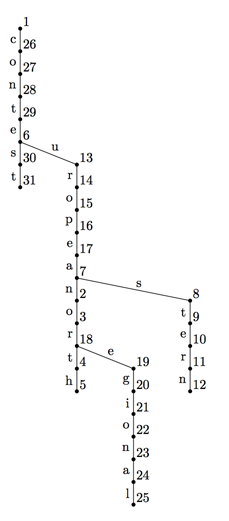

## 문제

Petr and Dmitry are working on a novel data compression scheme. Their task is to compress a given set of words. To compress a given set of words they have to build a rooted tree. Each edge of the tree is marked with exactly one letter.

Let us define a dictionary that is produced by this kind of tree as a set of words that can be constructed by concatenating letters on edges on any path from any vertex in the tree (not necessarily root) and going away from root down to the leaves (but not necessarily finishing on a leaf).

Boys have to construct such a tree with a dictionary that is a superset of the set of words that they are given to compress. This tree should have the smallest number of vertices between trees that satisfy the above condition. Any tree with the same number of vertices will do. Your task is to help them.

For example, in a tree on the picture above with the root marked as 1, a path from 7 to 5 reads “north”, a path from 16 to 12 reads “eastern”, a path from 29 to 2 reads “european”, a path from 3 to 25 reads “regional”, and a path from 1 to 31 reads “contest”.

## 입력

The first line of the input file contains the number of words in a given set n (1 ≤ n ≤ 50). The following n lines contain different non-empty words, one word per line, consisting of lowercase English letters. The length of each word is at most 10 characters.

## 출력

On the first line output the number of vertices in the tree m. The following m lines shall contain descriptions of tree vertices, one description per line. Vertices are indexed from 1 to n in the order of their corresponding description lines. If the corresponding vertex is a tree root, then its description line shall contain a single integer number 0, otherwise its description line shall contain an index of its parent node and a letter on the edge to its parent node, separated by a space.

## 힌트

This sample output corresponds to the picture from the problem statement.
