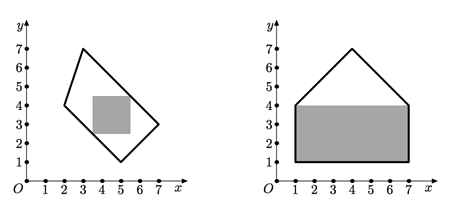

## 문제

Eva studies geometry. The current topic is about convex polygons, but Eva prefers rectangles. Eva’s workbook contains drawings of several convex polygons and she is curious what is the area of the maximum rectangle that fits inside each of them.

Help Eva! Given the convex polygon, find the rectangle of the maximum possible area that fits inside this polygon. Sides of the rectangle must be parallel to the coordinate axes.

## 입력

The first line contains a single integer n — the number of sides of the polygon (3 ≤ n ≤ 100 000). The following n lines contain Cartesian coordinates of the polygon’s vertices — two integers xi and yi (-109 ≤ xi, yi ≤ 109) per line. Vertices are given in the clockwise order.

The polygon is convex.

## 출력

Output four real numbers xmin, ymin, xmax and ymax — the coordinates of two rectangle’s corners (xmin < xmax, ymin < ymax). The rectangle must fit into the polygon and have the maximum possible area.

The absolute precision of the coordinates should be at least 10-5.

The absolute or relative precision of the rectangle area should be at least 10-5. That is, if A' is the actual maximum possible area, the following must hold: min(|A-A'|,|A−A'|/A') ) ≤ 10-5.
