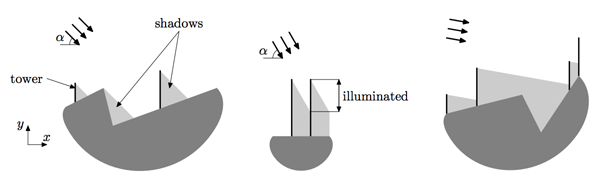

## 문제

The technological progress in Flatland is impressive. This year, for example, the solar power stations of a new type will be build. In these stations solar panels are mounted not on the ground, but on high towers, along their heights.

There are n towers to be mounted. The towers are already bought. The height of i-th tower is hi. Now engineers want to choose the points where they should be mounted to get the maximal total power.

The landscape of a territory of the power plant is described by a polyline with m vertices. Vertices of the landscape polyline have coordinates (xi, yi), such that xi < xi+1.

The sun angle is always α degrees in Flatland. The sun is shining from the top-left to the bottom-right. The power that is produced by a tower depends on the length of its surface illuminated by the sun.

When two towers are mounted close to each other, the shadow of the left tower may fall onto the right tower, so the power, produced by the right tower, decreases. Also, the landscape itself may contain high points that drop shadows on some towers.

Your task is to find the points on the territory of the plant to mount the given towers to maximize the total length of towers surface that is illuminated by the sun.

## 입력

The first line of the input file contains three integers n, m and α (1 ≤ n ≤ 104, 2 ≤ m ≤ 104, 1 ≤ α < 90). The second line contains n integers hi — the heights of the towers (1 ≤ hi ≤ 103). The following m lines contain pairs xi, yi — the coordinates of the vertices of the landscape (|xi| ≤ 105, xi < xi+1, |yi| ≤ 103).

## 출력

On the first line output the maximal possible summary length of towers that can be illuminated by the sun with an absolute precision of at least 10-6. On the next n lines output the x-coordinates of the points where the towers should be mounted to achieve this maximum with an absolute precision of at least 10-9. Towers should be listed in the same order they are given in the input file.

## 힌트

In this example two towers are mounted at the same point. This is allowed, but only one, the longest, of the towers mounted at the same point is considered to be illuminated by the sun.
