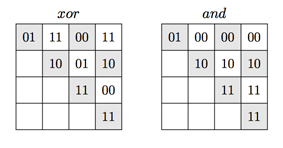

## 문제

Pavel is sending to his friend Egor some array of non-negative integers. He wants to be sure, that nobody hacks the array before his friend gets it. To solve this problem Pavel need to compute some kind of a checksum or a digest for his array. Pavel has an innovative mind, so he invents the following algorithm to compute the digest for his array: count the number of subarrays in which the bitwise xor of the numbers in the subarray is equal to the bitwise and of the same numbers.

For example, consider an array of four binary numbers “01”, “10”, “11”, and “11”. The table below to the left lists the results of the bitwise xor of numbers for each subarray of this array, and the table below to the right list the results of the bitwise and of numbers for each subarray of this array. The rows of the table correspond to the starting elements of the subarray from the 1st element of the array to the 4th one, while columns correspond to the ending elements of the subarray. Matching values are highlighted with gray background.

Your task is to help Pavel compute this kind of a digest of the given array.

## 입력

The first line contains one integer n (1 ≤ n ≤ 100 000). The second line contains n non-negative integers ai (0 ≤ ai ≤ 231-1) that are written in decimal notation.

## 출력

On the first line of the output print Pavel’s digest of the given array.

## 힌트

The above sample input corresponds to the example from the problem statement.
