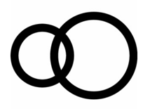

## 문제

We have N persons and N vacuum cleaners. How much area can we clean? If you are thinking- “Isn’t it a silly question? We can clean the entire hallway!” then you are wrong! You are forgetting that we need some electricity point in the floor to work with the vacuum cleaner. So it might not be possible to cover entire ground. Again the electrical wire of a vacuum cleaner is limited one as well. If a vacuum cleaner has wire of D units long, then the person using cleaner can go at most D unit distance away from the electrical point. But to make things worse, the cleaner have to be exactly D unit distance away. There is some glitch in the wire, so if the wire becomes loose at any moment (becomes less than D unit distance from the electrical point), the vacuum cleaner loses electricity. On top of this, the handle of the vacuum cleaner is too heavy, so the person cannot move the cleaner handle more than d unit distance from him. So to sum up, each cleaner has to be exactly D unit distance from the electric point and it can clean everything within d unit distance from it.

Now for each vacuum cleaner you are given D and d. Also you are given the co-ordinate of the electrical points where the vacuum cleaner is attached at. Find out the area of the ground that can be cleaned with the given setup. Please note that, some area can be covered by multiple persons but we are interested in the union of the area not sum of the area covered by individuals.

## 입력

In the first line of the input file number of test cases are given, T (≤ 30). Hence follow T test cases. Each test case starts with a positive integer N (≤ 500). In the next N lines you will be given description for the vacuum cleaners. Each line will contain, 4 integers: x y D d. (x, y) is the co-ordinate of the electrical point, D is the wire length and d is the distance of vacuum head from the person. (|x|, |y| ≤ 1000, 0 < D, d ≤ 200).

## 출력

For each case print the case number and the area of the ground that can be covered. Error up to 10−2 will be ignored.

## 힌트

**First Case**

Only one cleaner. Electrical point is at (0, 0) and D = 10, d = 1. So the person handling this cleaner will be moving around a circle with 10 unit radius centering at (0, 0). Since d = 1, the cleaner will be able to clean any dirt with in 1 unit distance from him. The region cleaned by the cleaner is denoted by black region in the following picture:

Here the black region is bounded by two circles both centering at co-ordinate (0, 0). Radii of the circles are 11 and 9. So the area covered = π × (112 − 92) = 125.663706.

**Second Case**

Two cleaners. Electrical point of first cleaner is at (0, 0) and the point for second cleaner is at (13, 0). For first cleaner D = 7, d = 1 while for second cleaner D = 10, d = 1. The region cleaned by the cleaners is denoted by black region in the following picture:

